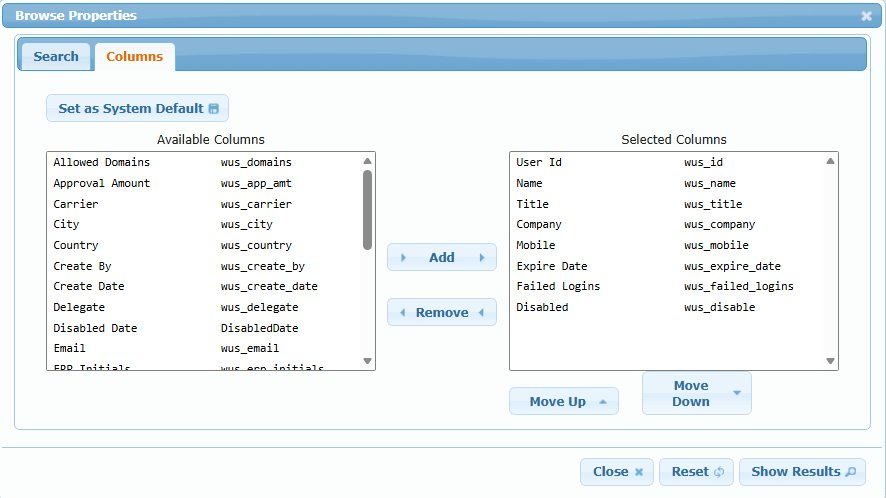

# Admin Browse Grid Component

## Overview

The Admin Browse Grid is a standard data grid component that appears at the bottom of virtually every Administration screen in iPurchase. It provides a consistent interface for viewing, selecting, searching, and exporting records.

## Purpose

- **View records** - Displays all records for the current screen (users, groups, rules, etc.)
- **Select for editing** - Click any row to load that record into the form above for editing
- **Search and filter** - Find specific records using the search dialog
- **Export data** - Export visible data to Excel
- **Customize columns** - Choose which columns to display

---

## Grid Toolbar Icons

The browse grid has a row of toolbar icons above the data:

| Icon | Name | Action |
|------|------|--------|
| 🔄 | Refresh | Refreshes the browse data from the database |
| 📊 | Column Picker | Opens Browse Properties dialog to select visible columns |
| 📥 | Excel Export | Exports currently visible columns and rows to Excel |
| 🔍 | Search | Opens Browse Properties dialog to the Search tab |

---

## Selecting Records

**To edit a record:**
1. Click any row in the browse grid
2. The record loads into the form fields above
3. Make changes in the form
4. Click Save to commit changes

The currently selected row is highlighted (typically in a darker shade).

---

## Column Sorting

**Single column sort:**
- Click a column header with the up/down arrow icon (↕)
- Click again to reverse sort direction

**Multi-column (compound) sort:**
- Click first column header to set primary sort
- **Ctrl+Click** a second column header to add secondary sort
- Continue Ctrl+clicking to add additional sort levels

**Note:** Not all columns are sortable. Only columns with the sort icon (↕) support sorting.

---

## Pagination

The pagination controls appear at the bottom left of the browse:

| Control | Function |
|---------|----------|
| ⏮ First | Jump to first page |
| ◀ Previous | Go to previous page |
| ▶ Next | Go to next page |
| ⏭ Last | Jump to last page |
| Page Size | Dropdown to select rows per page (e.g., 50, 100, 500) |

---

## Browse Properties Dialog

Accessed via the Column Picker (📊) or Search (🔍) icons. Has two tabs:

### Columns Tab



**Purpose:** Customize which columns appear in the browse grid.

**Layout:**
- **Available Columns** (left) - Columns not currently displayed
- **Selected Columns** (right) - Columns currently displayed, in display order

**Controls:**
| Button | Action |
|--------|--------|
| **Add →** | Move selected available column(s) to Selected |
| **← Remove** | Remove selected column(s) from display |
| **Move Up** | Move selected column up (displays further left) |
| **Move Down** | Move selected column down (displays further right) |
| **Set as System Default** | Save current column selection as default for all users |

**Column Format:**
Each column shows: `Display Name` + `database_field_name`

Example:
```
User Id          wus_id
Name             wus_name
Mobile           wus_mobile
```

### Search Tab


**Purpose:** Build search criteria to filter the browse results.

**Building Search Criteria:**

1. Select a field from the dropdown (e.g., Company, Title, Disabled)
2. Select an operator:
   - **Begins** - Field starts with value
   - **Contains** - Field contains value anywhere
   - **Equal To** - Exact match
   - **Not Equal** - Does not match
   - **Greater Than** / **Less Than** - For numeric/date fields
3. Enter the search value
4. For boolean fields (like Disabled), use the checkbox

**Combining Criteria:**

| Button | Action |
|--------|--------|
| **Group AND** | Selected criteria must ALL be true |
| **Group OR** | ANY of the selected criteria can be true |
| **Delete Selected** | Remove selected search criteria |
| **Clear Search** | Remove all search criteria |

**Example Search:**
Find users where Company begins with "ISS" OR Title begins with "VP", AND Disabled = false:
```
(Company Begins "ISS" OR Title Begins "VP")
AND
Disabled Equal To [unchecked]
```

**Dialog Buttons:**
| Button | Action |
|--------|--------|
| **Close** | Close dialog without applying changes |
| **Reset** | Reset to default columns/clear search |
| **Show Results** | Apply changes and refresh browse |

---

## Best Practices

1. **Use search to find records** - Much faster than scrolling through hundreds of rows
2. **Customize columns** - Remove columns you don't need for a cleaner view
3. **Set system defaults** - If you're an admin, set up useful default columns for all users
4. **Use compound sort** - Ctrl+click for multi-level sorting (e.g., by Company then by Name)
5. **Export before bulk changes** - Export to Excel as a backup before making mass updates

---

## Technical Notes

- Browse data is loaded when the screen opens
- Click Refresh to see changes made by other users
- Search criteria persist for the session but reset on logout
- Column selections can be saved as system default (affects all users)
- Export includes only visible columns and currently filtered rows

---

## Batch Operations

Some browse grids support batch operations on multiple selected records. When available, these features appear as:

### Selection Checkbox Column

A checkbox column appears as the first column in the browse. Use these to select multiple records:
- Click individual checkboxes to select specific records
- Selected records are highlighted

### Batch Operation Icons

Located at the bottom right of the browse (near pagination controls):

| Icon | Name | Action |
|------|------|--------|
| 🗑️ (Trash) | Batch Delete | Deletes all selected records |
| ✏️ (Pencil) | Batch Edit | Opens dialog to edit a field across all selected records |

### Batch Edit Workflow

1. Select multiple records using checkboxes
2. Click the Pencil icon
3. Select the field to modify
4. Enter the new value
5. Confirm to apply change to all selected records

**Use Cases:**
- Change Status on multiple jobs from "Complete" to "Active"
- Update a field value across many records at once
- Bulk cleanup operations

**Note:** Not all browse grids support batch operations. The checkbox column and batch icons only appear on grids where this functionality is enabled.
