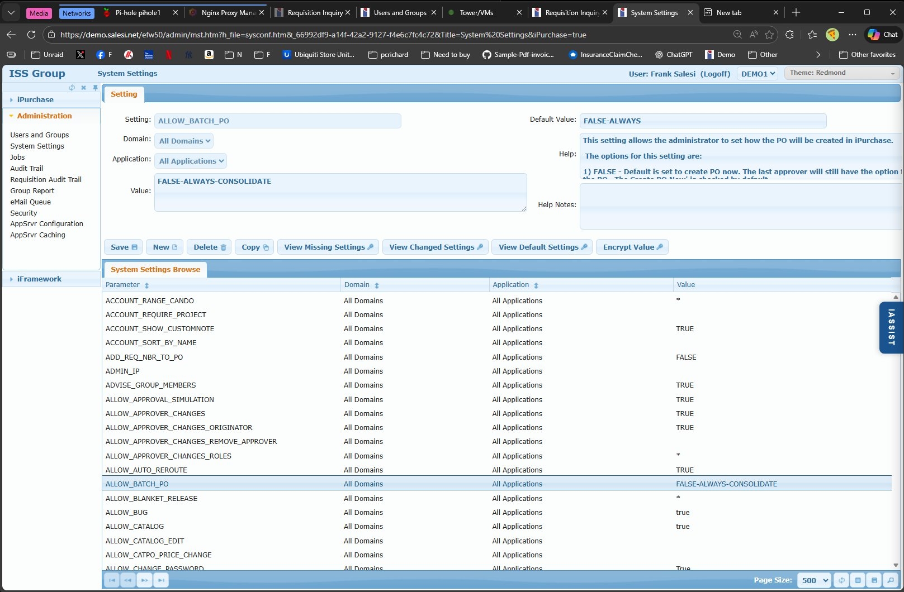

# System Settings Screen

## Overview

The System Settings screen is the central configuration interface for iPurchase. It provides access to 550+ configurable settings that control virtually every aspect of system behavior - from approval workflows and email notifications to purchase order formatting and user permissions.

Settings are stored in the `pf_mstr` table and can be configured globally, per-domain, or per-application, allowing for flexible multi-company and multi-application deployments.

## Access Path

Administration → System Settings

## Screenshot



## Screen Layout

The screen consists of two main sections:

1. **Setting Tab (Top)** - Form for viewing and editing individual settings
2. **System Settings Browse (Bottom)** - Grid listing all settings with their current values

---

## Setting Tab

### Field: Setting

- **Location**: Top left of form
- **Type**: Text input
- **Required**: Yes
- **Database**: `pf_mstr.pf_attr`
- **Description**: The setting name/parameter. Setting names are uppercase with underscores (e.g., `ALLOW_BATCH_PO`, `EMAIL_SUPPLIER_PO`).
- **Patterns**:
  - `ALLOW_*` - Permission settings (Can-Do list format)
  - `RT_[type]_*` - Requisition type-specific settings
  - `RT_[type][site]_*` - Requisition type and site-specific settings
  - `DEFAULT_*` - Default value settings
  - `EMAIL_*` - Email configuration settings
  - `PO_*` - Purchase order settings
  - `CO_*` - Change order settings
  - `OOF_*` - Out of office/delegation settings

### Field: Default Value

- **Location**: Top right of form (read-only display)
- **Type**: Display only
- **Database**: Not stored - retrieved from shipped defaults
- **Description**: Shows the out-of-the-box default value for this setting. Useful reference when the Value field has been customized - administrators can always see what the original shipped value was.

### Field: Domain

- **Location**: Below Setting field
- **Type**: Dropdown
- **Options**: "All Domains" or specific domain codes (e.g., demo1, demo2)
- **Database**: `pf_mstr.pf_us_id` (SYSTEM for All Domains, or domain code)
- **Description**: Controls the scope of this setting.
- **Business Rules**:
  - **All Domains**: Setting applies system-wide
  - **Specific Domain**: Creates a domain-specific override
  - Domain-specific settings take precedence over "All Domains" settings
- **Use Case**: A company with US and UK operations might set `DATE_FORMAT = "mdy"` for All Domains but create a domain-specific override for UK domain with `DATE_FORMAT = "dmy"`.

### Field: Application

- **Location**: Below Domain field
- **Type**: Dropdown
- **Options**: All Applications, iPurchase, iApprove
- **Database**: `pf_mstr.pf_group`
- **Description**: Controls which application(s) the setting applies to.
- **Business Rules**:
  - **All Applications**: Setting applies to both iPurchase and iApprove
  - **iPurchase**: Setting only affects iPurchase module
  - **iApprove**: Setting only affects iApprove module
- **Use Case**: Different email templates or approval behaviors for different modules.

### Field: Value

- **Location**: Large text area below Application
- **Type**: Multi-line text input
- **Required**: No (blank is a valid value for many settings)
- **Database**: `pf_mstr.pf_chr1`
- **Description**: The current value of the setting. Format varies by setting type:
  - **Boolean**: TRUE, FALSE, true, false
  - **Can-Do List**: Comma-separated values with optional wildcards and exclusions (e.g., `*`, `admin,buyers`, `!guest,*`)
  - **Numeric**: Numbers, decimals, percentages
  - **Text**: Free-form text, URLs, file paths
  - **List**: Comma-separated values
  - **Encrypted**: Values starting with `encrypted:` followed by encrypted data

### Field: Help

- **Location**: Right side of form
- **Type**: Multi-line text (editable)
- **Database**: `pf_mstr.pf_help`
- **Description**: Documentation for the setting. Ships with descriptions for all standard settings. Administrators can modify this text if needed to clarify site-specific usage.

### Field: Help Notes

- **Location**: Below Help field
- **Type**: Multi-line text (editable)
- **Database**: `pf_mstr.pf_chr2` (or similar)
- **Description**: Customer notes field for documenting when and why a setting was changed. Purely for administrative reference.
- **Best Practice**: Document the date, who made the change, and the business reason. Example: "2024-01-15 - Frank - Changed from 100 to 500 per finance request to reduce approval bottlenecks"

---

## Action Buttons

### Button: Save

- **Icon**: Disk icon
- **Action**: Commits the current setting to the database
- **Database Impact**: INSERT or UPDATE on `pf_mstr`
- **Validation**: Setting name is required

### Button: New

- **Icon**: Plus icon
- **Action**: Clears the form to create a new setting
- **Use Case**: Creating custom settings or domain-specific overrides

### Button: Delete

- **Icon**: Trash icon
- **Action**: Deletes the current setting record
- **Warning**: Deleting a shipped setting removes it from the system. Use "View Missing Settings" to identify and recreate deleted settings if needed.
- **Database Impact**: DELETE from `pf_mstr`

### Button: Copy

- **Icon**: Copy icon
- **Action**: Duplicates the current setting for modification
- **Use Case**: Creating domain-specific overrides or requisition type variations
- **Example Workflow**:
  1. Select `RT_EXPENSE_ACCOUNT_RANGE` 
  2. Click Copy
  3. Change Setting name to `RT_CAPITAL_ACCOUNT_RANGE`
  4. Modify Value as needed
  5. Save
- **Common Pattern**: Copy `RT_[Requisition Type]_*` settings and replace the type placeholder with actual types (Expense, Capital, Inventory, etc.)

### Button: View Missing Settings

- **Icon**: Document with question mark
- **Action**: Exports to Excel a list of settings that shipped with iPurchase but have been deleted from this installation
- **Use Case**: Audit and recovery - identify settings that may have been accidentally deleted
- **Output**: Excel file listing missing setting names

### Button: View Changed Settings

- **Icon**: Document with delta/change indicator
- **Action**: Shows settings where the current Value differs from the shipped default
- **Use Case**: 
  - Audit what customizations have been made
  - Document changes before upgrades
  - Troubleshooting - quickly see what's been modified from standard

### Button: View Default Settings

- **Icon**: Document with checkmark
- **Action**: Shows settings that are still at their out-of-the-box default values
- **Use Case**: Identify settings that haven't been reviewed or customized for this installation

### Button: Encrypt Value

- **Icon**: Key/lock icon
- **Action**: Encrypts the current Value field content
- **Use Case**: Sensitive data such as:
  - API keys (`APIKEY`)
  - Email passwords (`EMAIL_AUTH_PASSWORD`)
  - Integration credentials (`QAD_INTERFACE_PASSWORD`)
- **Result**: Value is replaced with `encrypted:` followed by encrypted data (e.g., `encrypted:JNX12n$#!@KJNJNK`)
- **Important**: Once encrypted, the original value cannot be viewed - only replaced with a new encrypted value

---

## System Settings Browse

The browse grid displays all settings with their current configuration.

### Browse Columns

| Column | Database Field | Description |
|--------|----------------|-------------|
| Parameter | `pf_attr` | Setting name |
| Domain | `pf_us_id` | "All Domains" or specific domain code |
| Application | `pf_group` | "All Applications", "iPurchase", or "iApprove" |
| Value | `pf_chr1` | Current setting value |

### Filtering and Searching

The browse can be filtered using the standard Admin Browse search functionality on indexed fields in `pf_mstr`. See [Admin Browse Grid Component](../components/admin-browse.md) for search interface details.

Settings are displayed alphabetically by Parameter name.

### Selecting a Setting

Click any row in the browse to load that setting into the form above for viewing or editing.

---

## Setting Hierarchy and Precedence

Settings follow a hierarchical override pattern. More specific settings take precedence:

```
1. Domain + Application specific  (most specific)
2. Domain + All Applications
3. All Domains + Application specific
4. All Domains + All Applications  (least specific - system default)
```

**Example**: For `EMAIL_SUPPLIER_PO` setting:
- All Domains / All Applications = "TRUE" (system default)
- demo2 / All Applications = "FALSE" (domain override)

When processing a requisition in demo2, the system uses "FALSE". All other domains use "TRUE".

---

## Setting Categories

iPurchase settings are organized into functional categories. While the browse displays settings alphabetically, understanding categories helps locate related settings:

| Category | Setting Prefixes/Patterns | Count |
|----------|---------------------------|-------|
| Approval Workflow | `ALLOW_APPROVAL*`, `ALLOW_APPROVER*`, `MULTIPLE_APPROVALS`, `AUTO_APPROVE*`, `SUPERVISOR_*` | 46 |
| Email Configuration | `EMAIL_*`, `EMAILFROM`, `EMAILSERVER` | 62 |
| Purchase Orders | `PO_*`, `ALLOW_BATCH_PO`, `BLANKET_*`, `DEFAULT_BUYER*` | 58 |
| Requisitions | `RT_*`, `REQUISITION_*`, `REQ_*` | 51 |
| Change Orders | `CO_*`, `PO_UPDATE_*`, `ALLOW_AUTO_REROUTE` | 16 |
| User Management | `ALLOW_*` (most), `VIEW_*`, `RESTRICT_*` | 45 |
| Catalog & Vendors | `CATALOG_*`, `PUNCHOUT_*`, `SUPPLIER_*`, `VENDOR_*` | 41 |
| GL Accounts & Finance | `ACCOUNT_*`, `BUDGET_*`, `*_TAX_*`, `PROJECT_*` | 38 |
| Security & Authentication | `PASSWORD_*`, `LOGIN_*`, `ALLOW_CHANGE_PASSWORD`, `FAILED_LOGIN*` | 29 |
| System Configuration | `COMPANY_NAME`, `DEFAULT_*`, `LICENSE`, `TEST_SYSTEM` | 29 |

For complete setting documentation, see the **system-settings-bible.csv** reference file.

---

## Common Setting Value Formats

### Boolean Values

```
TRUE, FALSE, true, false
```

### Can-Do List Format

Used for permission settings (`ALLOW_*`) and field restrictions:

| Value | Meaning |
|-------|---------|
| `*` | Everyone/everything allowed |
| (blank) | No one/nothing allowed |
| `admin,buyers` | Only admin and buyers groups |
| `!guest,*` | Everyone except guest |
| `8*,!8100` | Anything starting with 8, except 8100 |

### Requisition Type Settings Pattern

For requisition type-specific settings, replace `[Requisition Type]` with actual type:

```
RT_EXPENSE_ACCOUNT_RANGE = "8*"
RT_CAPITAL_ACCOUNT_RANGE = "8200"
RT_INVENTORY_ACCOUNT_RANGE = "1*,2*"
```

For site-specific overrides, append site code:

```
RT_EXPENSE_10000_ACCOUNT_RANGE = "8100,8200"
RT_EXPENSE_20000_ACCOUNT_RANGE = "8300,8400"
```

---

## Database Schema

### Primary Table: pf_mstr

```sql
pf_mstr
  pf_us_id      VARCHAR(10)     -- "SYSTEM" for All Domains, or domain code
  pf_group      VARCHAR(20)     -- "DEFAULT" for All Apps, or app name
  pf_attr       VARCHAR(50)     -- Setting name (e.g., ALLOW_BATCH_PO)
  pf_chr1       VARCHAR(500)    -- Setting value
  pf_help       VARCHAR(2000)   -- Help text/description
  pf_chr2       VARCHAR(500)    -- Help notes (customer notes)
  
-- Primary key is composite: (pf_us_id, pf_group, pf_attr)
```

### Query Examples

```sql
-- Get a specific system setting
SELECT pf_attr, pf_chr1, pf_help
FROM PUB.pf_mstr
WHERE pf_us_id = 'SYSTEM'
  AND pf_group = 'DEFAULT'
  AND pf_attr = 'ALLOW_BATCH_PO'

-- Get all approval-related settings
SELECT pf_attr, pf_chr1
FROM PUB.pf_mstr
WHERE pf_us_id = 'SYSTEM'
  AND pf_group = 'DEFAULT'
  AND pf_attr LIKE '%APPROV%'
ORDER BY pf_attr

-- Get domain-specific overrides for demo2
SELECT pf_attr, pf_chr1
FROM PUB.pf_mstr
WHERE pf_us_id = 'demo2'
  AND pf_group = 'DEFAULT'
ORDER BY pf_attr

-- Get all requisition type settings
SELECT pf_attr, pf_chr1
FROM PUB.pf_mstr
WHERE pf_us_id = 'SYSTEM'
  AND pf_group = 'DEFAULT'
  AND pf_attr LIKE 'RT_%'
ORDER BY pf_attr
```

---

## Business Rules

### Setting Creation
1. Setting names should be uppercase with underscores
2. Follow existing naming conventions for consistency
3. Domain-specific settings override global settings
4. Application-specific settings override "All Applications"

### Setting Deletion
1. Deleting a shipped setting removes functionality
2. Use "View Missing Settings" to audit deleted settings
3. Deleted settings can be recreated using the same name

### Setting Values
1. Boolean settings accept TRUE/FALSE (case-insensitive)
2. Can-Do lists are evaluated left-to-right, first match wins
3. Blank values are valid and often mean "disabled" or "no restriction"
4. Encrypted values cannot be decrypted for viewing

### Upgrades
1. New settings are added during upgrades
2. Existing customized values are preserved
3. Use "View Changed Settings" before upgrades to document customizations

---

## Common Issues

### Issue: Setting change not taking effect

**Cause 1**: Domain-specific override exists  
**Solution**: Check if a domain-specific setting is overriding the global setting

**Cause 2**: Application-specific setting exists  
**Solution**: Check Application dropdown - change may need to be made for specific application

**Cause 3**: Cache not refreshed  
**Solution**: Some settings require user logout/login or AppSrvr restart

### Issue: "Missing Settings" found after upgrade

**Cause**: Settings were deleted and not restored during upgrade  
**Solution**: Use "View Missing Settings" to export list, then recreate needed settings

### Issue: Encrypted value needs to be changed

**Cause**: Cannot decrypt to see current value  
**Solution**: Enter new value and click "Encrypt Value" - old value is replaced

### Issue: Can-Do list not working as expected

**Cause**: Order matters - first match wins  
**Solution**: Review Can-Do list logic. `!8100,8*` excludes 8100 then allows 8xxx. `8*,!8100` allows all 8xxx including 8100 (8* matches first).

---

## Tips & Best Practices

### Configuration Management
1. **Document all changes** in Help Notes with date and reason
2. **Use "View Changed Settings"** before upgrades to capture customizations
3. **Export settings periodically** for backup and documentation
4. **Test changes in non-production** before applying to production

### Domain-Specific Settings
5. **Start with global settings**, add domain overrides only when needed
6. **Use Copy button** to quickly create domain variations
7. **Be consistent** - if you override for one domain, review if others need it

### Requisition Type Settings
8. **Use Copy button** for RT_[type]_* settings to create type variations
9. **Remember site-specific patterns**: RT_EXPENSE_10000_* for site 10000
10. **Test after changes** - create a test requisition to verify behavior

### Security
11. **Always encrypt sensitive values** (passwords, API keys, credentials)
12. **Review ALLOW_* settings** regularly for appropriate access
13. **Restrict ALLOW_DELETE_PROCESSED** to minimal users

### Troubleshooting
14. **Check all levels** when debugging: All Domains, specific domain, All Apps, specific app
15. **Use View Changed Settings** to see what's been customized
16. **Compare to Default Value** shown in form to see shipped default

---

## Related Screens

- [Users and Groups](./01-users-and-groups.md) - User-specific settings stored in pf_mstr
- [Approval Rules (Complex)](./ipurchase-01-approval-rules.md) - Settings that affect approval workflow
- [Security](./08-security.md) - Password and login-related settings

---

## Related Documentation

- [System Settings Reference](../../reference/system-settings-reference.md#table-of-contents) - Complete catalog of all 550+ settings with categories and descriptions
- [Approval Rules (Complex)](./ipurchase-01-approval-rules.md) - How approval settings affect workflow routing
