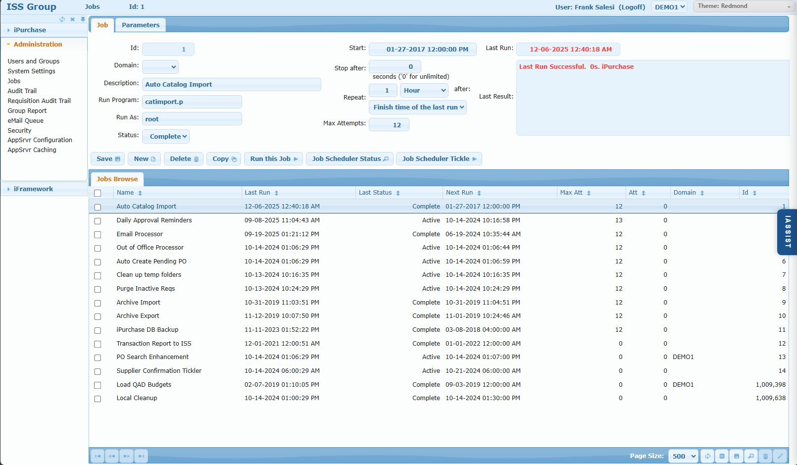
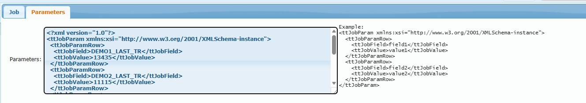

# Jobs Screen

## Overview

The Jobs screen manages periodic background jobs that run on a schedule. These jobs handle automated tasks such as sending approval reminders, processing emails, importing catalogs, cleaning up temporary files, and archiving data.

Jobs are triggered by an external scheduler (cron on Linux, Windows Task Scheduler on Windows) that "tickles" iPurchase every minute to check if any jobs need to execute.

## Access Path

Administration → Jobs

## Screenshot



## Screen Layout

The screen consists of two tabs and a browse grid:

1. **Job Tab** - Job configuration including schedule and status
2. **Parameters Tab** - Job-specific parameters (XML format)
3. **Jobs Browse** - Grid listing all configured jobs

---

## Job Tab

### Field: Id

- **Location**: Top left
- **Type**: Numeric (auto-generated)
- **Required**: System-assigned
- **Description**: Unique identifier for the job. Auto-assigned on job creation.

### Field: Domain

- **Location**: Below Id
- **Type**: Dropdown
- **Options**: Blank (All Domains) or specific domain code
- **Description**: Scope of the job execution.
- **Business Rule**: 
  - **Blank**: Job runs for all domains (most common)
  - **Specific Domain**: Job runs only for that domain
  - This value is passed as a parameter to the Run Program

### Field: Description

- **Location**: Below Domain
- **Type**: Text input
- **Required**: Yes
- **Description**: Descriptive name for the job. Displayed in the browse grid and logs.
- **Examples**: "Auto Catalog Import", "Daily Approval Reminders", "Email Processor"

### Field: Run Program

- **Location**: Below Description
- **Type**: Text input
- **Required**: Yes
- **Description**: The Progress program (.p file) to execute when the job runs.
- **Examples**: `catimport.p`, `job_email.p`, `job_purge.p`

### Field: Run As

- **Location**: Below Run Program
- **Type**: Text input (User ID)
- **Required**: Yes
- **Description**: The iPurchase user context under which the job runs.
- **Business Rules**:
  - Should be set to the customer's helpdesk user or system administrator account
  - This user receives email notifications when jobs fail
  - Should NOT be "root" - use a proper iPurchase user account
- **Example**: `helpdesk`, `sysadmin`, `iPurchaseAdmin`

### Field: Status

- **Location**: Below Run As
- **Type**: Dropdown
- **Options**: Active, Complete, In Process, Error
- **Required**: Yes
- **Description**: Current state of the job.
- **Status Values**:

| Status | Meaning | Action |
|--------|---------|--------|
| **Active** | Job is scheduled and will run at next scheduled time | Normal operating state |
| **Complete** | Job is disabled and will not run | Set to Active to re-enable |
| **In Process** | Job is currently executing | If stuck > 90 seconds, manually set back to Active |
| **Error** | Job failed and is in retry cycle | Will retry up to Max Attempts times |

### Field: Start

- **Location**: Right side, top
- **Type**: DateTime picker
- **Required**: Yes
- **Description**: The date and time when this job should first run (or next run after being reset).
- **Format**: MM-DD-YYYY HH:MM:SS AM/PM

### Field: Last Run

- **Location**: Right of Start (read-only display)
- **Type**: DateTime (read-only)
- **Description**: Timestamp of the most recent job execution.
- **Display**: Shows in orange/highlighted color

### Field: Stop after

- **Location**: Below Start
- **Type**: Numeric
- **Default**: 0
- **Description**: Maximum execution time in seconds before the job is forcefully stopped.
- **Business Rule**: 
  - `0` = unlimited (no timeout)
  - Use for long-running jobs that might hang

### Field: Last Result

- **Location**: Right of Stop after (read-only display)
- **Type**: Text (read-only)
- **Description**: Result message from the last job execution.
- **Display**: Shows success/failure message in green (success) or red (error)
- **Example**: "Last Run Successful. 0s. iPurchase"

### Field: Repeat

- **Location**: Below Stop after
- **Type**: Numeric + Unit dropdown + Base dropdown
- **Components**:
  - **Number**: Frequency value (e.g., 1, 2, 24)
  - **Unit**: Hour, Minute, Day, Week, Month
  - **Base**: "Finish time of the last run" or "Start time"
- **Description**: How often the job should repeat.
- **Examples**:
  - `1 Hour after Finish time of the last run` - Run hourly, starting after previous run completes
  - `24 Hour after Start time` - Run daily at the same time

### Field: Max Attempts

- **Location**: Below Repeat
- **Type**: Numeric
- **Default**: 12
- **Description**: Maximum number of retry attempts when a job fails.
- **Business Rules**:
  - Each failed attempt sends an email to the Run As user
  - Retries use exponential backoff starting at 2 seconds
  - 12 attempts ≈ 2 days of retries before giving up
  - After max attempts, job status remains Error until manually reset

---

## Parameters Tab



### Field: Parameters

- **Type**: Multi-line text (XML format)
- **Description**: Job-specific parameters stored as XML. Used to pass configuration to the Run Program and maintain state between runs.

**XML Format:**
```xml
<?xml version="1.0"?>
<ttJobParam xmlns:xsi="http://www.w3.org/2001/XMLSchema-instance">
  <ttJobParamRow>
    <ttJobField>field1</ttJobField>
    <ttJobValue>value1</ttJobValue>
  </ttJobParamRow>
  <ttJobParamRow>
    <ttJobField>field2</ttJobField>
    <ttJobValue>value2</ttJobValue>
  </ttJobParamRow>
</ttJobParam>
```

**Business Rules**:
- Parameters are typically managed by the Run Program itself
- Administrators can manually edit if needed (e.g., to reset state)
- Used to track progress, last processed record ID, etc.
- Example shows tracking last transaction IDs per domain for incremental processing

---

## Action Buttons

### Button: Save

- **Action**: Commits job configuration to database

### Button: New

- **Action**: Clears form to create a new job

### Button: Delete

- **Action**: Deletes the selected job
- **Warning**: Deleting a job removes all history and parameters

### Button: Copy

- **Action**: Duplicates the current job for modification
- **Use Case**: Creating a similar job with different parameters or schedule

### Button: Run this Job

- **Action**: Executes the job immediately, regardless of schedule
- **Use Case**: Testing a new job, forcing an immediate run
- **Note**: Job runs in foreground - wait for completion

### Button: Job Scheduler Status

- **Action**: Displays status of the external scheduler
- **Shows**: Whether cron (Linux) or Windows Task Scheduler is properly configured and running
- **Use Case**: Troubleshooting when jobs aren't executing on schedule

### Button: Job Scheduler Tickle

- **Action**: Manually triggers the scheduler to check for jobs to run
- **Use Case**: 
  - Testing before cron is configured
  - Forcing immediate check for pending jobs
  - Development and troubleshooting

---

## Jobs Browse

The browse grid displays all configured jobs with their current status and schedule.

### Browse Columns

| Column | Description |
|--------|-------------|
| (Checkbox) | Select for batch operations |
| Name | Job description |
| Last Run | Timestamp of most recent execution |
| Last Status | Result of last run (Active, Complete, Error) |
| Next Run | Scheduled time for next execution |
| Max Att | Maximum retry attempts configured |
| Att | Current attempt count (for jobs in Error status) |
| Domain | Domain scope (blank = all domains) |
| Id | Unique job identifier |

### Batch Operations

The browse supports batch operations via icons at the bottom right:
- **Trash icon**: Delete multiple selected jobs
- **Pencil icon**: Batch edit selected jobs

See [Admin Browse Grid Component](../components/admin-browse.md) for full browse functionality.

---

## Common Jobs

| Job Name | Purpose | Typical Schedule |
|----------|---------|------------------|
| Daily Approval Reminders | Sends reminder emails to approvers with pending requisitions | Daily |
| Email Processor | Processes outbound email queue | Every few minutes |
| Out of Office Processor | Handles delegation changes when users go OOF | Hourly |
| Auto Create Pending PO | Creates POs from approved requisitions in batch mode | Hourly |
| Clean up temp folders | Removes temporary files | Daily |
| Purge Inactive Reqs | Archives old requisitions per retention policy | Daily |
| Auto Catalog Import | Imports catalog updates from suppliers | As needed |
| Archive Import/Export | Handles data archival processes | As needed |
| iPurchase DB Backup | Database backup job | Daily |
| Supplier Confirmation Tickler | Reminds suppliers to confirm PO receipt | Daily |

---

## Job Execution Flow

```
1. External scheduler (cron/Windows Task) runs every minute
                    ↓
2. Scheduler "tickles" iPurchase job engine
                    ↓
3. Job engine checks for Active jobs where Start time ≤ now
                    ↓
4. For each ready job:
   a. Set status to "In Process"
   b. Execute Run Program with Parameters
   c. On success: Set status to "Active", update Last Run, calculate Next Run
   d. On failure: Increment Att, schedule retry with exponential backoff
                    ↓
5. If Att ≥ Max Attempts: Leave status as "Error", stop retrying
```

## Retry Backoff Schedule

When a job fails, retries are scheduled with exponential backoff:

| Attempt | Wait Time | Cumulative Time |
|---------|-----------|-----------------|
| 1 | 2 seconds | 2 seconds |
| 2 | 4 seconds | 6 seconds |
| 3 | 8 seconds | 14 seconds |
| 4 | 16 seconds | 30 seconds |
| 5 | 32 seconds | ~1 minute |
| 6 | ~1 minute | ~2 minutes |
| 7 | ~2 minutes | ~4 minutes |
| 8 | ~4 minutes | ~8 minutes |
| 9 | ~8 minutes | ~16 minutes |
| 10 | ~17 minutes | ~33 minutes |
| 11 | ~34 minutes | ~1 hour |
| 12 | ~1 hour | ~2 hours |

With 12 attempts, total retry period spans approximately 2 days.

---

## Business Rules

### Job Scheduling
1. Jobs only run when Status = Active
2. External scheduler must be configured (cron or Windows Task)
3. Jobs execute sequentially, not in parallel
4. "Finish time of last run" prevents job overlap

### Error Handling
1. Failed jobs automatically retry up to Max Attempts
2. Each failure sends email to Run As user
3. Exponential backoff prevents rapid-fire retries
4. After max attempts, manual intervention required

### Stuck Jobs
1. If Status = "In Process" for more than ~90 seconds, job is likely stuck
2. Cause: Database shutdown, server crash, or hung process
3. Resolution: Manually set Status back to "Active"

---

## Common Issues

### Issue: Jobs not running on schedule

**Cause 1**: External scheduler not configured  
**Solution**: Click "Job Scheduler Status" to verify cron/Windows Task is running

**Cause 2**: Job Status is not "Active"  
**Solution**: Change Status to "Active"

**Cause 3**: Start time is in the future  
**Solution**: Update Start time to current or past datetime

### Issue: Job stuck "In Process"

**Cause**: Server crash, database restart, or hung process  
**Solution**: Manually change Status to "Active" to allow next scheduled run

### Issue: Job keeps failing (Error status)

**Cause**: Program error, configuration issue, or external dependency failure  
**Solution**: 
1. Check Last Result for error message
2. Review job logs
3. Check Parameters tab for incorrect values
4. Verify Run Program exists and is accessible

### Issue: Not receiving error notification emails

**Cause 1**: Run As user has invalid email  
**Solution**: Verify the Run As user has valid email in Users and Groups

**Cause 2**: Email Processor job is not running  
**Solution**: Check Email Processor job status

---

## Tips & Best Practices

### Configuration
1. **Use a dedicated service account** for Run As, not personal user accounts
2. **Set appropriate Max Attempts** - 12 is good for most jobs
3. **Use "Finish time" base** for repeat to prevent job overlap
4. **Document custom jobs** in the Description field

### Monitoring
5. **Check job status regularly** - especially critical jobs like Email Processor
6. **Review Last Result** for any error patterns
7. **Set up external monitoring** for critical job failures

### Troubleshooting
8. **Use "Run this Job"** to test immediately without waiting for schedule
9. **Use "Job Scheduler Tickle"** to verify scheduler connectivity
10. **Check Parameters tab** when jobs behave unexpectedly

---

## Related Screens

- [System Settings](./02-system-settings.md) - Job-related settings (EMAIL_*, JOB_*)
- [eMail Queue](./07-email-queue.md) - Monitor outbound emails generated by jobs

---

## Related System Settings

See also: [System Configuration Settings](../../reference/system-settings-reference.md#system-configuration)


| Setting | Purpose |
|---------|---------|
| `JOB_RETRY_EMAIL_LAST` | If TRUE, only send failure email on final retry attempt |
| `WINDOWS_TASK_NAME` | Windows Task Scheduler task name for job tickler |
| `WORK_DAY_START_TIME` | Start of business day for scheduling |
| `WORK_DAY_STOP_TIME` | End of business day for scheduling |
