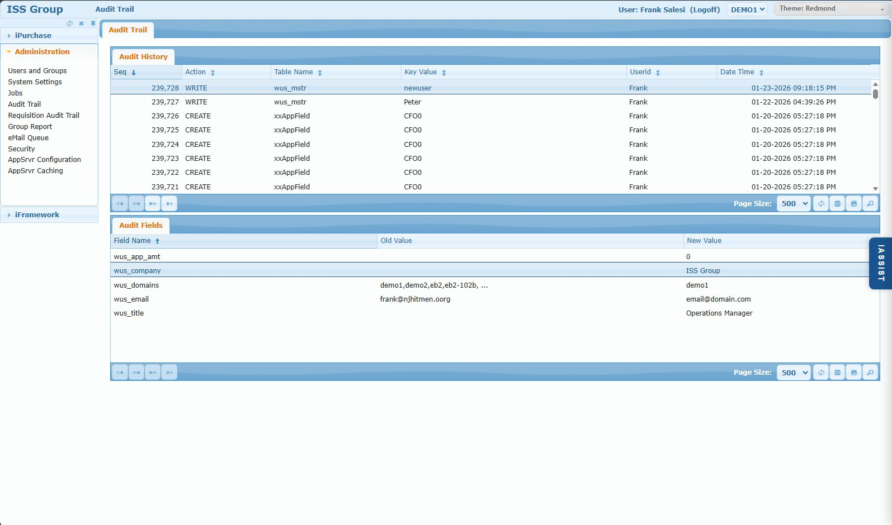

# Audit Trail Screen

## Overview

The Audit Trail screen provides a comprehensive log of all changes made to key database tables in iPurchase. Every CREATE, WRITE (update), and DELETE action is recorded with the user who made the change, timestamp, and before/after field values.

This screen is essential for compliance, troubleshooting, and answering questions like "Who changed this setting?" or "What did user X modify yesterday?"

**Note:** For requisition-specific audit history, see the [Requisition Audit Trail](./05-requisition-audit-trail.md) screen which provides a more user-friendly view focused on requisition workflow.

## Access Path

Administration → Audit Trail

## Screenshot



## Screen Layout

The screen consists of two browse grids:

1. **Audit History (Top)** - List of audit records showing what changed, when, and by whom
2. **Audit Fields (Bottom)** - Field-level detail showing old and new values for the selected record

---

## Audit History Browse

### Browse Columns

| Column | Description |
|--------|-------------|
| Seq | Unique sequence number for the audit record |
| Action | Type of change: CREATE, WRITE, or DELETE |
| Table Name | Database table that was modified |
| Key Value | Primary key identifier for the record (see Key Value Reference below) |
| Userid | User who made the change |
| Date Time | Timestamp of the change |

### Action Types

| Action | Meaning |
|--------|---------|
| CREATE | New record was inserted |
| WRITE | Existing record was updated |
| DELETE | Record was deleted |

---

## Audit Fields Browse

When you select a record in the Audit History browse, the Audit Fields browse displays the field-level changes:

| Column | Description |
|--------|-------------|
| Field Name | Database field that was changed |
| Old Value | Value before the change (blank for CREATE) |
| New Value | Value after the change (blank for DELETE) |

---

## Audited Tables Reference

### Shared Tables (Blank Domain)

These tables are shared across all domains. Search with blank domain or leave domain filter empty.

| Table | Purpose | Key Value Format | Example |
|-------|---------|------------------|---------|
| wus_mstr | Users | User ID | `frank` |
| wgr_mstr | Groups | Group code | `admin` |
| wugr_mstr | User-Group membership | Group:User | `admin:frank` |
| pf_mstr | System Settings | Scope:Setting | `SYSTEM:REQUISITION_TYPES` |
| pf_mstr | User Defaults | User:Field | `FRANK:DEPT` |

### Approval Rules Tables (Domain = "*")

Complex approval rules use asterisk for domain since rules can span domains.

| Table | Purpose | Key Value Format | Example |
|-------|---------|------------------|---------|
| xxAppRule | Complex approval rules | Rule name | `ChangeOrder` |
| xxAppField | Approval rule conditions | RuleName + Seq (no separator) | `ChangeOrder0` |

### Domain-Specific Tables

These tables require a specific domain. Select the appropriate domain when searching.

| Table | Purpose | Key Value Format | Example |
|-------|---------|------------------|---------|
| xxreq_mstr | Requisition header | Requisition number | `T0408319` |
| xxreqd_det | Requisition line items | Req:Line | `T0408319:1` |
| ipSupplier | Punchout suppliers | Supplier number | `STAPLES` |

---

## Searching the Audit Trail

Use the browse search feature to find specific audit records. The most common search patterns are:

### Search by Table and Key Value

Find all changes to a specific record:

| To Find | Table Name | Key Value |
|---------|------------|-----------|
| Changes to user "frank" | `wus_mstr` | `frank` |
| Changes to System Setting | `pf_mstr` | `SYSTEM:ALLOW_BATCH_PO` |
| Changes to a requisition | `xxreq_mstr` | `T0408319` |
| Changes to req line 1 | `xxreqd_det` | `T0408319:1` |
| Changes to a group | `wgr_mstr` | `buyers` |
| User added to group | `wugr_mstr` | `buyers:frank` |
| Changes to approval rule | `xxAppRule` | `CFO Approval` |
| Approval rule conditions | `xxAppField` | Begins `CFO Approval` |
| Changes to punchout supplier | `ipSupplier` | `STAPLES` |

### Search by User and Date

Find what a specific user changed:

| Search Field | Operator | Value |
|--------------|----------|-------|
| Userid | Equal To | `frank` |
| Date Time | Greater Than or Equal To | `01-20-2026` |

### Search Operators

| Operator | Use For |
|----------|---------|
| Equal To | Exact match |
| Begins | Partial match from start (useful for xxAppField) |
| Not Equal To | Exclude specific values |
| Greater Than or Equal To | Date ranges (from date) |
| Less Than or Equal To | Date ranges (to date) |
| Greater Than | After a specific date/time |
| Less Than | Before a specific date/time |

### Combining Search Criteria

Use Group AND / Group OR buttons to build complex searches:

**Example:** Find all changes Frank made to system settings yesterday
- Userid Equal To `frank`
- AND Table Name Equal To `pf_mstr`
- AND Date Time Greater Than or Equal To `01-22-2026`
- AND Date Time Less Than `01-23-2026`

---

## Common Use Cases

### "Who changed this system setting?"

1. Search: Table Name = `pf_mstr`, Key Value = `SYSTEM:SETTING_NAME`
2. Review the Userid and Date Time columns
3. Select the record to see old/new values in Audit Fields

### "What did user X change recently?"

1. Search: Userid = `username`, Date Time >= `date`
2. Review all tables and changes made by that user

### "When was this user's approval limit changed?"

1. Search: Table Name = `wus_mstr`, Key Value = `userid`
2. Look for records where `wus_app_amt` appears in Audit Fields

### "Who added/removed users from a group?"

1. Search: Table Name = `wugr_mstr`, Key Value Begins `groupname:`
2. CREATE = user added, DELETE = user removed

### "What changes were made to an approval rule?"

1. Search: Table Name = `xxAppRule`, Key Value = `RuleName`
2. For rule conditions: Table Name = `xxAppField`, Key Value Begins `RuleName`

---

## Database Schema

### Primary Table: efw_audit

```sql
efw_audit
  efw_audit_sequence    INTEGER       -- Unique sequence number
  efw_audit_domain      CHARACTER     -- Domain (blank, *, or domain code)
  efw_audit_table       CHARACTER     -- Table name that was modified
  efw_audit_key_value   CHARACTER     -- Primary key of the modified record
  efw_audit_action      CHARACTER     -- CREATE, WRITE, or DELETE
  efw_audit_userid      CHARACTER     -- User who made the change
  efw_audit_date        DATE          -- Date of change
  efw_audit_time        INTEGER       -- Time of change (seconds after midnight)
  efw_audit_datetime    DATETIME      -- Combined date/time
  efw_audit_datetime_tz DATETIME-TZ   -- Date/time with timezone
  efw_audit_fields      CHARACTER     -- List of fields that changed
  efw_audit_before_xml  BLOB          -- XML of record before change
  efw_audit_after_xml   BLOB          -- XML of record after change
```

### Query Examples

```sql
-- Find all changes to a specific user
SELECT efw_audit_sequence, efw_audit_action, efw_audit_datetime, efw_audit_userid
FROM PUB.efw_audit
WHERE efw_audit_domain = ''
  AND efw_audit_table = 'wus_mstr'
  AND efw_audit_key_value = 'frank'
ORDER BY efw_audit_sequence DESC

-- Find all changes made by a user on a specific date
SELECT efw_audit_sequence, efw_audit_table, efw_audit_key_value, efw_audit_action
FROM PUB.efw_audit
WHERE efw_audit_userid = 'frank'
  AND efw_audit_date = '2026-01-22'
ORDER BY efw_audit_sequence DESC

-- Find all system setting changes
SELECT efw_audit_sequence, efw_audit_key_value, efw_audit_action, 
       efw_audit_userid, efw_audit_datetime
FROM PUB.efw_audit
WHERE efw_audit_domain = ''
  AND efw_audit_table = 'pf_mstr'
  AND efw_audit_key_value LIKE 'SYSTEM:%'
ORDER BY efw_audit_sequence DESC
```

---

## Business Rules

1. **Automatic auditing** - All changes to audited tables are logged automatically
2. **Cannot be disabled** - Auditing is always active for these tables
3. **Immutable records** - Audit records cannot be modified or deleted through the application
4. **Case insensitive** - All searches and key values are case insensitive

---

## Tips & Best Practices

1. **Know the key value format** - Each table has a specific key value pattern (see reference above)
2. **Use "Begins" for xxAppField** - Rule conditions use concatenated key values
3. **Check the domain** - Shared tables use blank domain, approval rules use "*", others use specific domain
4. **Combine date + user** - Most effective for "what changed" investigations
5. **Review Audit Fields** - Always check the bottom browse to see actual before/after values

---

## Related Screens

- [Users and Groups](./01-users-and-groups.md) - User records audited in wus_mstr
- [System Settings](./02-system-settings.md) - Settings audited in pf_mstr
- Requisition Audit Trail - User-friendly requisition history (documentation pending)
- Approval Rules - Rule changes audited in xxAppRule/xxAppField (documentation pending)
