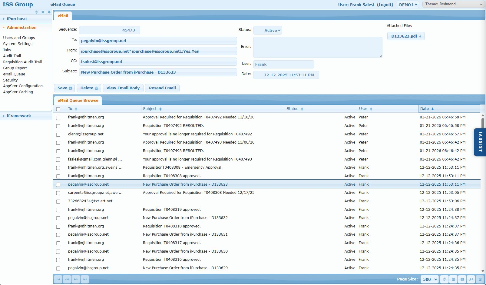

# eMail Queue Screen

## Overview

The eMail Queue screen displays all outbound emails generated by iPurchase. This serves as both a queue for pending emails and a log of sent emails. When any iPurchase function needs to send an email (approval notifications, PO emails to suppliers, password resets, etc.), the email is queued here and processed by the Email Processor job.

Data is retained for a configurable period (default 90 days) controlled by the `EMAIL_PURGE_DAYS` system setting.

## Access Path

Administration → eMail Queue

## Screenshot



## Screen Layout

The screen consists of:

1. **eMail Tab** - Email details and editable fields
2. **Attached Files** - List of attachments (top right)
3. **eMail Queue Browse** - Grid listing all queued/sent emails

---

## eMail Tab

### Field: Sequence

- **Type**: Numeric (auto-generated, read-only)
- **Description**: Unique identifier for the email record

### Field: To

- **Type**: Text (editable)
- **Description**: Recipient email address(es). Multiple addresses separated by commas.

### Field: From

- **Type**: Text (editable)
- **Description**: Sender email address. Format includes reply-to configuration.
- **Example**: `ipurchase@issgroup.net^ipurchase@issgroup.net☐Yes,Yes`

### Field: CC

- **Type**: Text (editable)
- **Description**: Carbon copy recipients

### Field: Subject

- **Type**: Text (editable)
- **Description**: Email subject line

### Field: Status

- **Type**: Dropdown
- **Options**: Active, Complete, Error
- **Description**: Current state of the email

| Status | Meaning |
|--------|---------|
| **Active** | Pending - will be sent on next Email Processor run |
| **Complete** | Successfully sent |
| **Error** | Failed to send - check Error field for details |

### Field: Error

- **Type**: Text (read-only)
- **Description**: Error message if email failed to send. Use this to diagnose delivery issues.

### Field: User

- **Type**: Text (read-only)
- **Description**: iPurchase user who triggered the email

### Field: Date

- **Type**: DateTime (read-only)
- **Description**: When the email was queued

### Attached Files

- **Location**: Top right corner
- **Description**: List of file attachments (e.g., PO PDFs)
- **Action**: Click filename to download attachment

---

## Action Buttons

### Button: Save

- **Action**: Saves changes to editable fields (To, From, CC, Subject, Status)
- **Use Case**: Fix email address typos before resending

### Button: Delete

- **Action**: Deletes the email record
- **Note**: Use to clean up errored emails that shouldn't be retried

### Button: View Email Body

- **Action**: Opens the full HTML email body in a viewer
- **Note**: Email body cannot be edited

### Button: Resend Email

- **Action**: Sets status back to Active so email will be resent on next job run
- **Use Case**: After fixing recipient address or resolving delivery issues

---

## eMail Queue Browse

### Browse Columns

| Column | Description |
|--------|-------------|
| (Checkbox) | Select for batch operations |
| To | Recipient email address(es) |
| Subject | Email subject line |
| Status | Active, Complete, or Error |
| User | User who triggered the email |
| Date | When email was queued |

---

## Email Processing Flow

```
1. iPurchase action triggers email (approval, PO creation, etc.)
                    ↓
2. Email queued with Status = "Active"
                    ↓
3. Email Processor job runs (every minute via cron)
                    ↓
4. Job processes all Active emails
                    ↓
5a. Success → Status = "Complete"
5b. Failure → Status = "Error", error message stored
                    ↓
6. Completed/Errored emails retained per EMAIL_PURGE_DAYS setting
                    ↓
7. Old emails automatically purged
```

---

## Common Email Types

| Subject Pattern | Trigger |
|-----------------|---------|
| Approval Required for Requisition... | Requisition submitted, awaiting approval |
| Requisition [number] REROUTED | Requisition routing changed |
| Your approval is no longer required... | Approver removed from routing |
| Requisition [number] approved | Final approval completed |
| New Purchase Order from iPurchase... | PO created and sent to supplier |
| Emergency Approval | Emergency approval requested |

---

## Business Rules

1. **Email body is read-only** - Only header fields (To, From, CC, Subject) can be edited
2. **Resend requeues the email** - Sets status to Active for next job run
3. **Attachments are preserved** - PO PDFs and other attachments remain with the email
4. **Retention is configurable** - `EMAIL_PURGE_DAYS` controls how long records are kept

---

## Common Issues

### Issue: Emails stuck in Active status

**Cause**: Email Processor job not running  
**Solution**: Check [Jobs](./03-jobs.md) screen - verify Email Processor job is Active and running

### Issue: Email shows Error status

**Cause**: SMTP delivery failure  
**Solution**: 
1. Check Error field for details
2. Common causes: invalid email address, SMTP server issues, authentication problems
3. Fix the issue, then click Resend Email

### Issue: Recipient didn't receive email

**Cause 1**: Email still Active (not yet processed)  
**Solution**: Wait for next job run or manually tickle the job

**Cause 2**: Email in spam/junk folder  
**Solution**: Check recipient's spam folder; whitelist sender address

**Cause 3**: Invalid email address  
**Solution**: Search for email in queue, check To field, fix and resend

---

## Tips & Best Practices

1. **Monitor Error status emails** - These indicate delivery problems that may need attention
2. **Use search to find specific emails** - Search by recipient, subject, or date
3. **Check attachments** - Verify PO PDFs are attached before resending supplier emails
4. **Review before resending** - Verify all fields are correct before clicking Resend

---

## Related System Settings

| Setting | Purpose | Default |
|---------|---------|---------|
| `EMAIL_PURGE_DAYS` | Days to retain email records | 90 |
| `EMAILSERVER` | SMTP server address and port | - |
| `EMAILFROM` | Default sender address | - |
| `EMAIL_AUTH_USER` | SMTP authentication username | - |
| `EMAIL_AUTH_PASSWORD` | SMTP authentication password (encrypted) | - |
| `EMAIL_AUTH_TYPE` | Authentication type (TLS, SSL, etc.) | - |
| `EMAILS_TO` | Override all recipients (for testing) | - |

---

## Related Screens

- [Jobs](./03-jobs.md) - Email Processor job configuration
- [System Settings](./02-system-settings.md) - Email configuration settings
