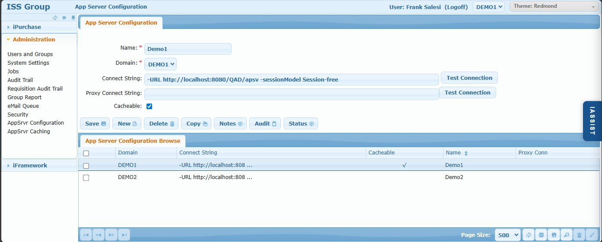

# AppSrvr Configuration Screen

## Overview

The AppSrvr Configuration screen manages connections between iPurchase and QAD ERP domains. Each QAD domain requires its own AppServer configuration entry, even if multiple domains reside in the same physical QAD database.

iPurchase does not communicate directly with QAD. Instead, it connects to the **ISS Connector** - a middleware application server that knows how to read and write QAD data. When iPurchase needs supplier lists, PO data, or other QAD information, it requests this from the ISS Connector, which handles the QAD communication and returns results to iPurchase.

## Access Path

Administration → AppSrvr Configuration

## Screenshot



## Screen Layout

The screen consists of:

1. **App Server Configuration Tab** - Connection settings for a QAD domain
2. **App Server Configuration Browse** - Grid listing all configured domains

---

## App Server Configuration Tab

### Field: Name

- **Type**: Text input
- **Required**: Yes
- **Description**: Friendly name/label for this configuration. Typically matches the Domain value.
- **Example**: `Demo1`

### Field: Domain

- **Type**: Dropdown
- **Required**: Yes
- **Description**: The QAD domain code this configuration connects to. Dropdown is populated from `ALLOWED_DOMAINS` system setting.
- **Example**: `DEMO1`

### Field: Connect String

- **Type**: Text input
- **Required**: Yes
- **Description**: Connection URL to the ISS Connector application server for this domain.
- **Format**: `-URL http://[host]:[port]/[path] -sessionModel Session-free`
- **Example**: `-URL http://localhost:8080/QAD/apsv -sessionModel Session-free`

### Field: Proxy Connect String

- **Type**: Text input
- **Required**: No
- **Description**: Connection string for a proxy broker when version compatibility requires it.
- **When Needed**: OpenEdge can only communicate one version back. If iPurchase runs on OE v12 but the QAD instance runs on OE v10, a v11 proxy broker bridges the gap:
  - iPurchase (v12) → Proxy Broker (v11) → ISS Connector (v10) → QAD (v10)
- **Leave Blank**: When iPurchase and QAD are on compatible OpenEdge versions

### Field: Cacheable

- **Type**: Checkbox
- **Default**: Checked
- **Description**: Enables caching of data retrieved from this domain's QAD instance.
- **Use Case**: When iPurchase runs in North America but a domain's QAD database is in Asia, caching prevents thousands of redundant cross-continent requests daily.
- **Related**: See [AppSrvr Caching](./10-appsrvr-caching.md) for what data types are cached.

---

## Action Buttons

### Button: Save

- **Action**: Saves the AppServer configuration

### Button: New

- **Action**: Clears form to create a new configuration

### Button: Delete

- **Action**: Deletes the selected configuration
- **Warning**: Removes iPurchase's ability to communicate with this QAD domain

### Button: Copy

- **Action**: Duplicates configuration for creating similar entries

### Button: Notes

- **Action**: Opens free-form notes for this configuration
- **Use Case**: Document server details, contact info, or special configuration notes

### Button: Audit

- **Action**: Shows audit trail of changes to this configuration record

### Button: Status

- **Action**: Displays current connection status/health

### Button: Test Connection

- **Action**: Verifies connectivity to the ISS Connector
- **Location**: Next to Connect String field
- **Result**: Success or error message indicating connection status
- **Note**: There's also a Test Connection button for the Proxy Connect String

---

## App Server Configuration Browse

### Browse Columns

| Column | Description |
|--------|-------------|
| (Checkbox) | Select for batch operations |
| Domain | QAD domain code |
| Connect String | ISS Connector URL |
| Cacheable | Whether caching is enabled (✓) |
| Name | Friendly name |
| Proxy Conn | Proxy connection string (if configured) |

---

## Adding a New Domain to iPurchase

Adding a new QAD domain requires multiple configuration steps across several screens. Follow this procedure carefully:

### Step 1: Update ALLOWED_DOMAINS System Setting

1. Go to [System Settings](./02-system-settings.md)
2. Search for `ALLOWED_DOMAINS`
3. Add the new domain code to the comma-separated list
4. Save

### Step 2: Grant Yourself Access

1. Go to [Users and Groups](./01-users-and-groups.md)
2. Find your user record
3. Add the new domain to your `wus_domains` field (or ensure it's set to `*`)
4. Save

### Step 3: Log Off and Back On

- Your domain list is cached for the session
- You must log out and log back in to see the new domain in dropdowns

### Step 4: Create AppSrvr Configuration

1. Return to this screen (AppSrvr Configuration)
2. Click **New**
3. Enter Name (friendly label)
4. Select the new Domain from dropdown
5. Enter Connect String to the ISS Connector
6. Enter Proxy Connect String if needed for version compatibility
7. Check/uncheck Cacheable as appropriate
8. Save
9. Click **Test Connection** to verify connectivity

### Step 5: Restart the iPurchase Broker

**Critical**: The broker must be restarted for the new domain to be fully active.

**For OpenEdge v11:**
```bash
wtbman -name [broker_name]_WS -port [port] -refresh
```
Example: `wtbman -name ipurchase_WS -port 18000 -refresh`

**For OpenEdge v12 (PASOE):**
Restart the PASOE instance through your standard PASOE administration procedures.

**Alternative**: Use the OS Command ("CMD") feature in iFramework Workbench (documented in iFramework section).

### Step 6: Grant User Access

1. Go to [Users and Groups](./01-users-and-groups.md)
2. For each user who needs access to the new domain:
   - Edit their user record
   - Add the new domain to `wus_domains`
   - Save

### Step 7: Configure Domain-Specific Settings

1. Review [System Settings](./02-system-settings.md) for settings that may need domain-specific values
2. Configure approval rules for the new domain if different from global rules
3. Set up any domain-specific requisition type settings (RT_[type]_* patterns)

---

## Architecture Overview

```
┌─────────────────┐
│   iPurchase     │
│ (Webspeed/PASOE)│
└────────┬────────┘
         │
         │ Connect String
         ▼
┌─────────────────┐
│  ISS Connector  │
│  (AppServer)    │
└────────┬────────┘
         │
         │ QAD API
         ▼
┌─────────────────┐
│   QAD ERP       │
│   Database      │
└─────────────────┘
```

**With Proxy (version compatibility):**

```
┌─────────────────┐
│   iPurchase     │
│   (OE v12)      │
└────────┬────────┘
         │
         │ Proxy Connect String
         ▼
┌─────────────────┐
│  Proxy Broker   │
│   (OE v11)      │
└────────┬────────┘
         │
         │ Connect String
         ▼
┌─────────────────┐
│  ISS Connector  │
│   (OE v10)      │
└────────┬────────┘
         │
         ▼
┌─────────────────┐
│   QAD ERP       │
│   (OE v10)      │
└─────────────────┘
```

---

## Business Rules

1. **One configuration per domain** - Even if domains share the same physical QAD database
2. **Domain must be in ALLOWED_DOMAINS** - Before it appears in the Domain dropdown
3. **Broker restart required** - New domains aren't fully active until broker restarts
4. **User access is separate** - AppServer config enables the connection; user `wus_domains` grants access

---

## Common Issues

### Issue: Domain not appearing in dropdown

**Cause**: Domain not in ALLOWED_DOMAINS  
**Solution**: Add domain to ALLOWED_DOMAINS system setting, then log off/on

### Issue: Test Connection fails

**Cause 1**: ISS Connector not running  
**Solution**: Verify ISS Connector AppServer is started

**Cause 2**: Incorrect connect string  
**Solution**: Verify URL, port, and path are correct

**Cause 3**: Network/firewall blocking connection  
**Solution**: Check network connectivity and firewall rules

### Issue: Domain works in test but not in application

**Cause**: Broker not restarted after adding configuration  
**Solution**: Restart the iPurchase Webspeed broker or PASOE instance

### Issue: Version compatibility errors

**Cause**: OpenEdge version mismatch (more than one version apart)  
**Solution**: Configure a proxy broker at an intermediate version

---

## Tips & Best Practices

1. **Always test connection** before considering configuration complete
2. **Document proxy setups** in Notes - version compatibility can be confusing later
3. **Restart broker** immediately after adding new domain to avoid confusion
4. **Use consistent naming** - Keep Name and Domain values the same when possible
5. **Enable caching** for geographically distant QAD instances

---

## Related Screens

- [AppSrvr Caching](./10-appsrvr-caching.md) - Configure what data is cached
- [System Settings](./02-system-settings.md) - ALLOWED_DOMAINS and domain-specific settings
- [Users and Groups](./01-users-and-groups.md) - User domain access (wus_domains)
