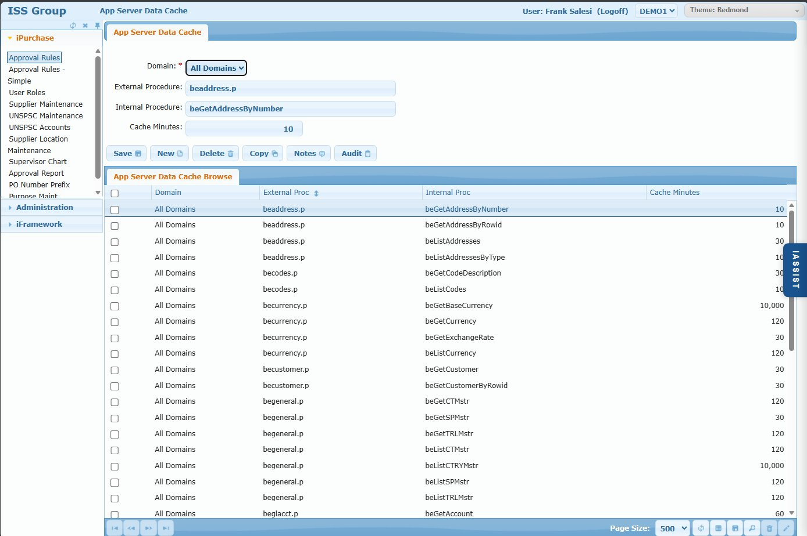

# AppSrvr Caching Screen

## Overview

The AppSrvr Caching screen defines which ISS Connector procedures can have their results cached and for how long. When caching is enabled for a domain (see [AppSrvr Configuration](./09-appsrvr-configuration.md)), iPurchase stores results from QAD queries locally to reduce redundant calls to the ISS Connector.

> **Note:** Caching is a legacy feature that is rarely used in modern deployments. iPurchase typically runs on the same server as QAD, with all domains residing in the same database, making caching unnecessary. This screen is documented for completeness and for customers with older distributed architectures.

## Access Path

Administration → AppSrvr Caching

## Screenshot



## Screen Layout

The screen consists of:

1. **App Server Data Cache Tab** - Cache settings for a specific procedure
2. **App Server Data Cache Browse** - Grid listing all cacheable procedures

---

## App Server Data Cache Tab

### Field: Domain

- **Type**: Dropdown
- **Required**: Yes
- **Options**: "All Domains" or specific domain code
- **Description**: Which domain(s) this cache rule applies to. "All Domains" creates a global default.

### Field: External Procedure

- **Type**: Text (read-only display)
- **Description**: The ISS Connector procedure file (e.g., `beaddress.p`, `becurrency.p`)
- **Note**: These are the Progress/OpenEdge procedure files in the ISS Connector that communicate with QAD

### Field: Internal Procedure

- **Type**: Text (read-only display)
- **Description**: The specific function within the external procedure (e.g., `beGetAddressByNumber`, `beListCodes`)
- **Note**: Each external procedure can contain multiple internal procedures/functions

### Field: Cache Minutes

- **Type**: Numeric
- **Description**: How long (in minutes) to cache results from this procedure
- **Examples**:
  - `10` - Cache for 10 minutes (frequently changing data)
  - `120` - Cache for 2 hours (relatively stable data)
  - `10,000` - Cache for ~7 days (rarely changing reference data like countries)

---

## Action Buttons

### Button: Save

- **Action**: Saves the cache configuration

### Button: New

- **Action**: Creates a new cache rule

### Button: Delete

- **Action**: Deletes the selected cache rule

### Button: Copy

- **Action**: Duplicates configuration for creating similar entries

### Button: Notes

- **Action**: Opens free-form notes

### Button: Audit

- **Action**: Shows audit trail of changes

---

## App Server Data Cache Browse

### Browse Columns

| Column | Description |
|--------|-------------|
| (Checkbox) | Select for batch operations |
| Domain | "All Domains" or specific domain code |
| External Proc | ISS Connector procedure file |
| Internal Proc | Function within the procedure |
| Cache Minutes | Duration to cache results |

---

## Common Cached Procedures

| External Proc | Internal Proc | Purpose | Typical Cache |
|---------------|---------------|---------|---------------|
| beaddress.p | beGetAddressByNumber | Get address by ID | 10 min |
| beaddress.p | beListAddresses | List all addresses | 30 min |
| becodes.p | beListCodes | Code/lookup tables | 10 min |
| becodes.p | beGetCodeDescription | Code descriptions | 30 min |
| becurrency.p | beGetBaseCurrency | Base currency | 10,000 min |
| becurrency.p | beGetExchangeRate | Exchange rates | 30 min |
| becurrency.p | beListCurrency | Currency list | 120 min |
| becustomer.p | beGetCustomer | Customer data | 30 min |
| begeneral.p | beListCTRYMstr | Country list | 10,000 min |
| begeneral.p | beListSPMstr | Salesperson list | 120 min |
| beglacct.p | beGetAccount | GL account info | 60 min |

---

## How Caching Works

```
1. User action requires QAD data (e.g., supplier lookup)
                    ↓
2. iPurchase checks: Is this procedure cacheable?
                    ↓
3a. NOT cacheable → Call ISS Connector directly
                    ↓
3b. CACHEABLE → Check local cache
                    ↓
4a. Cache HIT (valid data exists) → Return cached data
                    ↓
4b. Cache MISS (no data or expired) → Call ISS Connector
                    ↓
5. Store result in cache with timestamp
                    ↓
6. Return data to user
```

---

## Business Rules

1. **Domain override** - Domain-specific rules override "All Domains" rules
2. **Cache expiration** - Data is refreshed after Cache Minutes expires
3. **Requires Cacheable flag** - Domain must have Cacheable checked in AppSrvr Configuration
4. **Per-procedure control** - Each ISS Connector function can have different cache duration

---

## When to Use Caching

Caching was designed for scenarios where:

- iPurchase runs in a different geographic location than QAD
- Network latency between iPurchase and QAD is significant
- High user volume causes excessive QAD queries

**Modern deployments** typically don't need caching because:

- iPurchase runs on the same server as QAD
- All domains are in the same database
- Local network communication is fast

---

## Cache Duration Guidelines

| Data Type | Recommended Cache | Rationale |
|-----------|-------------------|-----------|
| Reference data (countries, currencies) | 10,000 min (~7 days) | Rarely changes |
| Master data (suppliers, customers) | 30-120 min | Changes occasionally |
| Transactional lookups | 10-30 min | May change frequently |
| Exchange rates | 30 min | Updates periodically |
| Real-time data | Don't cache (0 or remove rule) | Must be current |

---

## Tips & Best Practices

1. **Start conservative** - Use shorter cache times initially, increase if stable
2. **Monitor performance** - If users report stale data, reduce cache duration
3. **Consider data volatility** - Reference data can cache longer than transactional data
4. **Domain-specific overrides** - Use for domains with different data update patterns

---

## Related Screens

- [AppSrvr Configuration](./09-appsrvr-configuration.md) - Enable/disable caching per domain
