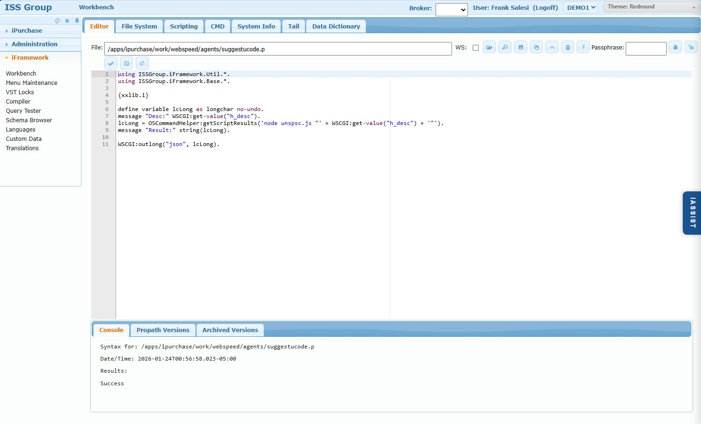
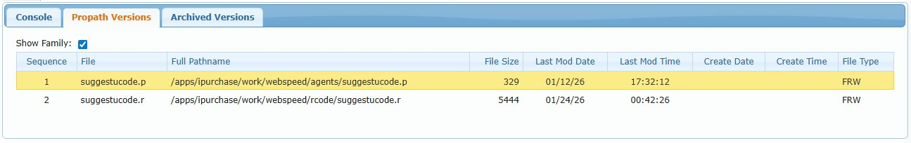
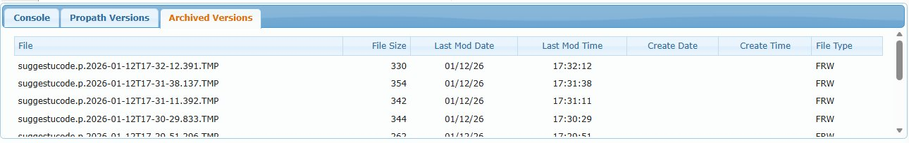
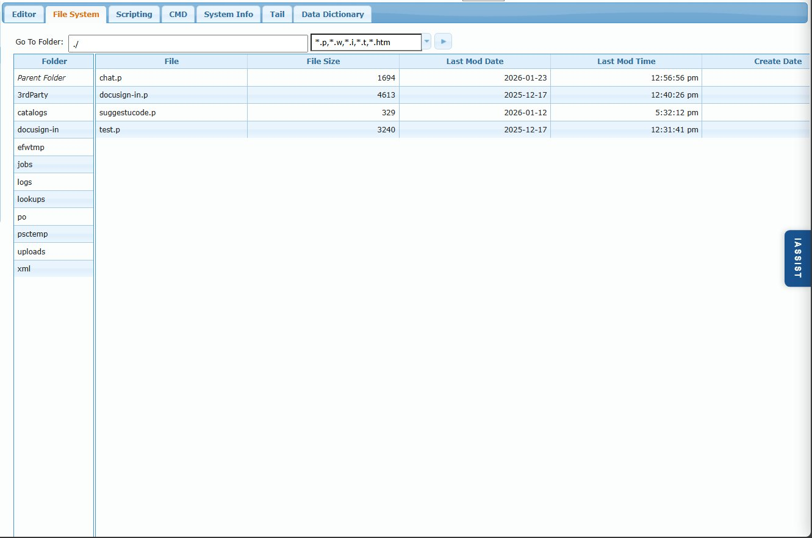
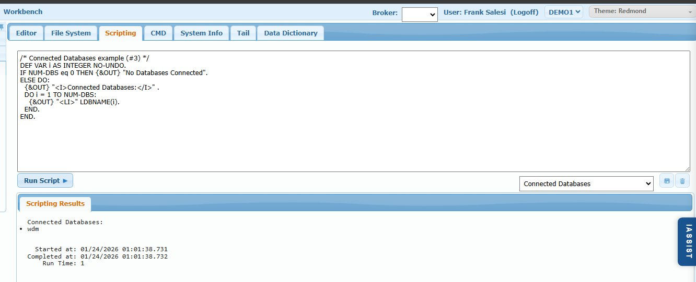
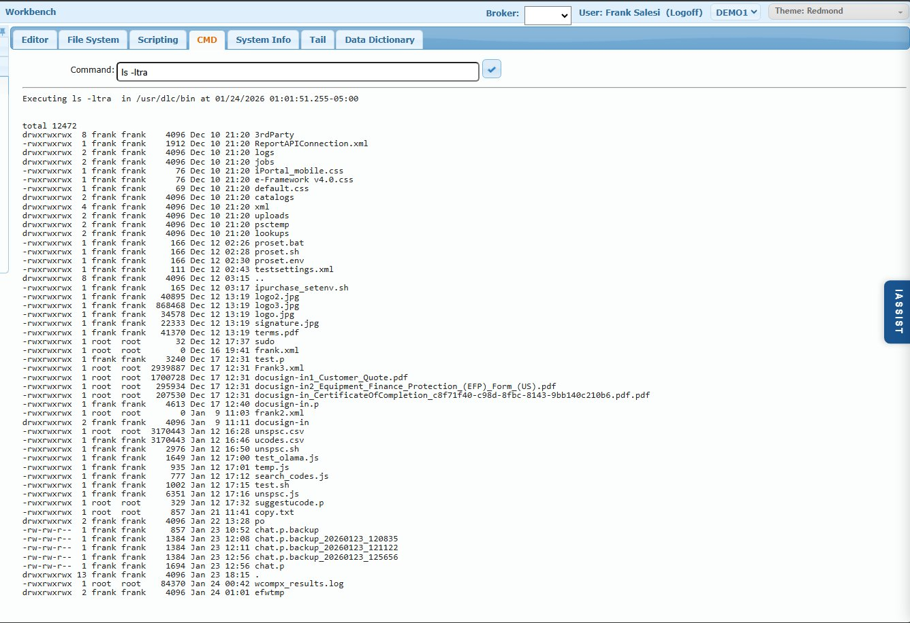
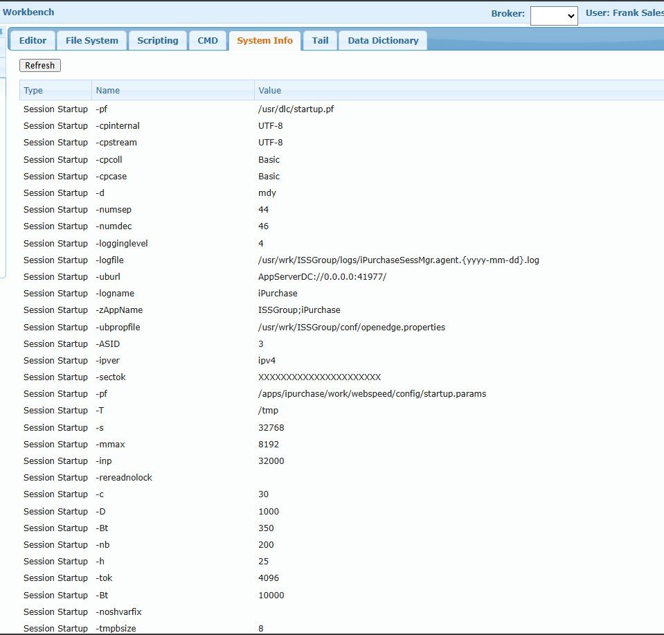
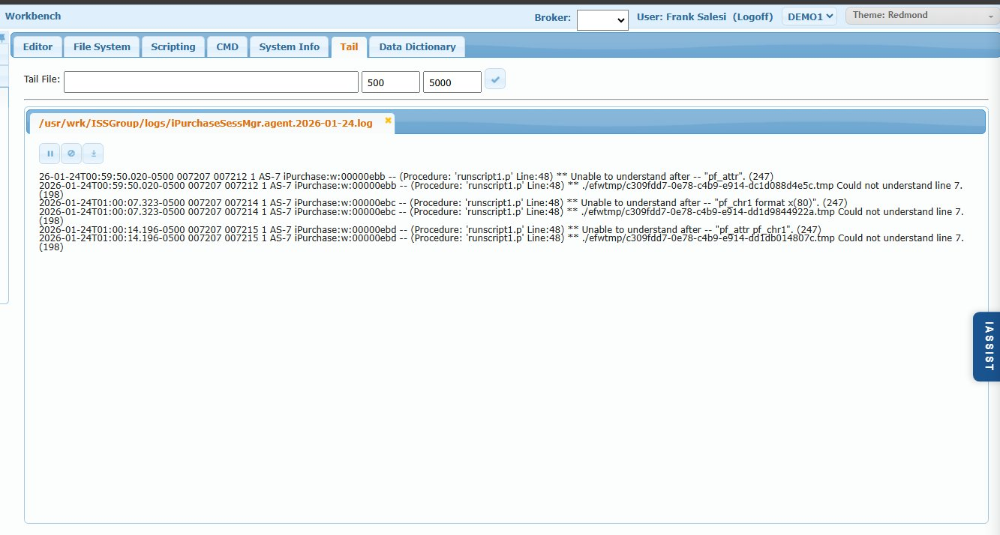
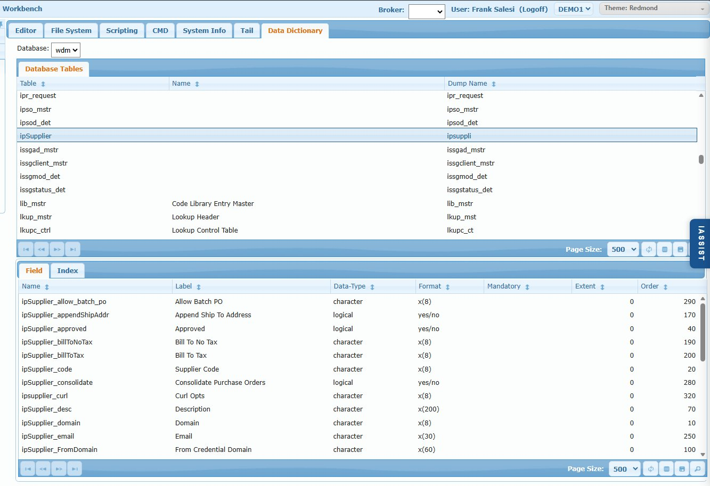

# Workbench

## Overview

The Workbench is the primary developer tool for iFramework applications. It provides a complete remote development and troubleshooting environment with code editing, file management, script execution, command-line access, log viewing, and database schema browsing.

**⚠️ CRITICAL SECURITY WARNING:** This tool provides full system access including code modification, OS command execution, and database browsing. Access should be restricted to ISS personnel and highly experienced administrators/developers only. End customers should NEVER have access to this functionality.

## Access Path

iFramework → Workbench

## Broker Selection

iPurchase is a distributed system with multiple brokers:
- **iPurchase Webspeed Broker** - Runs the web application (leave blank to select)
- **Domain App Servers** (demo1, demo2, etc.) - Connect to QAD environments

**You must select the appropriate broker before performing any operations.** The broker dropdown at the top right determines which environment your actions affect.

---

## Tab: Editor

The Editor tab provides a full-featured code editor for Progress/OpenEdge ABL source files (.p, .w, .i, .htm).



### File Field

Enter the filename or path to open. Supports:
- Full path: `/apps/ipurchase/work/webspeed/agents/suggestucode.p`
- Filename only: `setreqline.p` (system searches Propath)

### Toolbar Row 1 (File Operations)

| Icon | Name | Description |
|------|------|-------------|
| ✓ | TBD | Reserved for future use (DNU) |
| 📁 | Open | Opens file from File field. If found in multiple Propath locations, shows dropdown to select which version |
| 🔍 | MRU List | Shows Most Recently Used files list for quick access |
| 💾 | Save | Saves current file (auto-creates archived version) |
| 📋 | Copy | Opens dialog to copy file to new location/name |
| → | Rename | Opens dialog to rename/move file |
| 🗑️ | Delete | Deletes the current file |
| ⬆️ | Upload | Upload a local file to server, prompts for destination path |
| **Passphrase** | Decrypt Field | Enter ISS encryption passphrase to unlock encrypted source files |
| 🔒 | Lock | Encrypt/lock the current file |
| 🔓 | Unlock | Decrypt/unlock the current file (requires passphrase) |

**Note:** ISS code is encrypted. Only ISS personnel have the passphrase to unlock protected source files.

### Toolbar Row 2 (Code Operations)

| Icon | Name | Description |
|------|------|-------------|
| ✓ | Check Syntax | Validates ABL syntax without compiling |
| 📜 | Compile | Compiles the current file to r-code |
| ⬇️ | Download | Download the file to your local machine |

### Code Editor

- Syntax highlighting for Progress/OpenEdge ABL
- Line numbers
- Standard editing features

### Console Panel (Bottom)

Three tabs showing file information:

#### Console Tab
Shows results of syntax checks and compile operations:
```
Syntax for: /apps/ipurchase/work/webspeed/agents/suggestucode.p
Date/Time: 2026-01-24T00:56:58.023-05:00
Results:
Success
```

#### Propath Versions Tab


Shows all versions of the current file found across the Propath:

| Column | Description |
|--------|-------------|
| Sequence | Order in Propath (lower = higher priority) |
| File | Filename with extension |
| Full Pathname | Complete file path |
| File Size | Size in bytes |
| Last Mod Date | Last modification date |
| Last Mod Time | Last modification time |
| Create Date | File creation date |
| Create Time | File creation time |
| File Type | File permissions (FRW = File Read/Write) |

**Show Family checkbox:** When checked, shows related files (.p source, .r compiled r-code)

#### Archived Versions Tab


Shows automatic backup versions created on each save:

| Column | Description |
|--------|-------------|
| File | Archived filename with timestamp (e.g., `suggestucode.p.2026-01-12T17-32-12.391.TMP`) |
| File Size | Size in bytes |
| Last Mod Date/Time | When archive was created |
| Create Date/Time | Original creation date |
| File Type | File permissions |

**Archiving is automatic** - Every save creates a timestamped backup, allowing rollback to previous versions.

---

## Tab: File System



Browse and navigate the server file system.

### Controls

| Field | Description |
|-------|-------------|
| **Go To Folder** | Enter path to navigate (e.g., `./` for current, `/apps/ipurchase/`) |
| **File Filter** | Filter files by extension (default: `*.p,*.w,*.i,*.t,*.htm`) |

### Browse Columns

| Column | Description |
|--------|-------------|
| Folder | Directory names (click to navigate) |
| File | File names (click to open in Editor) |
| File Size | Size in bytes |
| Last Mod Date | Last modification date |
| Last Mod Time | Last modification time |
| Create Date | File creation date |

### Navigation

- Click folder names to navigate into directories
- Click "Parent Folder" to go up one level
- Click file names to open in Editor tab

---

## Tab: Scripting



Execute Progress/OpenEdge ABL code snippets directly without creating files.

### Controls

| Element | Description |
|---------|-------------|
| **Code Area** | Enter ABL code to execute |
| **Run Script** | Execute the code |
| **Dropdown** | Select from saved script examples (e.g., "Connected Databases") |
| 💾 | Save current script |
| 🗑️ | Delete saved script |

### Scripting Results Panel

Shows output from script execution:
```
Connected Databases:
• wdm

Started at: 01/24/2026 01:01:38.731
Completed at: 01/24/2026 01:01:38.732
Run Time: 1
```

### Use Cases

- Quick database queries
- Testing code snippets
- System diagnostics
- One-off data fixes (use with caution!)

### Example: Connected Databases
```
/* Connected Databases example (#3) */
DEF VAR i AS INTEGER NO-UNDO.
IF NUM-DBS eq 0 THEN {&OUT} "No Databases Connected".
ELSE DO:
  {&OUT} "<I>Connected Databases:</I>" .
  DO i = 1 TO NUM-DBS:
    {&OUT} "<LI>" LDBNAME(i).
  END.
END.
```

---

## Tab: CMD



Execute operating system commands on the server.

### Controls

| Field | Description |
|-------|-------------|
| **Command** | Enter OS command to execute |
| ✓ | Execute the command |

### Output Area

Shows command output with execution timestamp:
```
Executing ls -ltra  in /usr/dlc/bin at 01/24/2026 01:01:51.255-05:00

total 12472
drwxrwxrwx  8 frank frank    4096 Dec 10 21:20 3rdParty
-rwxrwxrwx  1 frank frank    1912 Dec 10 21:20 ReportAPIConnection.xml
...
```

### Common Commands

- `ls -ltra` - List files with details
- `df -h` - Check disk space
- `ps aux | grep _progres` - Find Progress processes
- `tail -100 /path/to/logfile` - View log tail
- `cat /path/to/file` - Display file contents

**⚠️ Warning:** Full OS command access. Use with extreme caution.

---

## Tab: System Info



Displays Progress session startup parameters and system configuration.

### Controls

| Button | Description |
|--------|-------------|
| **Refresh** | Reload system information |

### Information Displayed

| Type | Name | Description |
|------|------|-------------|
| Session Startup | -pf | Parameter file path |
| Session Startup | -cpinternal | Internal code page (UTF-8) |
| Session Startup | -cpstream | Stream code page (UTF-8) |
| Session Startup | -d | Date format (mdy) |
| Session Startup | -numsep | Numeric separator (44 = comma) |
| Session Startup | -numdec | Decimal separator (46 = period) |
| Session Startup | -logginglevel | Log verbosity (4) |
| Session Startup | -logfile | Log file path |
| Session Startup | -uburl | AppServer URL |
| Session Startup | -zAppName | Application name |
| Session Startup | -pf | Startup params file |
| Session Startup | -T | Temp directory |
| Session Startup | -s | Stack size |
| Session Startup | -mmax | Max memory |
| Session Startup | -inp | Input buffer size |
| Session Startup | -c | Client type |
| Session Startup | -D | Directory entries |
| Session Startup | -Bt | Before-image buffers |
| Session Startup | -nb | Number of buffers |
| Session Startup | -h | Hash table entries |
| Session Startup | -tok | Token table size |

### Use Cases

- Verify session configuration
- Troubleshoot memory/performance issues
- Check log file locations
- Verify database connections

---

## Tab: Tail



Real-time log file viewer (similar to Unix `tail -f`).

### Controls

| Field | Description |
|-------|-------------|
| **Tail File** | Path to log file |
| **First Number** | Number of lines to initially display (e.g., 500) |
| **Second Number** | Refresh interval in milliseconds (e.g., 5000) |
| ✓ | Start tailing |

### Log Panel

- Shows log file path as clickable tab (can tail multiple files)
- **X** to close a tail session
- Real-time updates at specified interval

### Control Buttons

| Button | Description |
|--------|-------------|
| ⏸️ | Pause tailing |
| 🚫 | Clear display |
| ⬇️ | Scroll to bottom |

### Common Log Files

- `/usr/wrk/ISSGroup/logs/iPurchaseSessMgr.agent.{yyyy-mm-dd}.log` - Application log
- Error logs, transaction logs, etc.

### Use Cases

- Monitor application errors in real-time
- Debug issues as they occur
- Watch for specific error patterns

---

## Tab: Data Dictionary



Browse database schema - tables, fields, and indexes.

### Controls

| Field | Description |
|-------|-------------|
| **Database** | Select database to browse (wdm, mfg, etc.) |

### Database Tables Panel

| Column | Description |
|--------|-------------|
| Table | Table name |
| Name | Table description/label |
| Dump Name | Table dump name |

Click a table to view its fields and indexes.

### Field Tab

| Column | Description |
|--------|-------------|
| Name | Field name |
| Label | Field label/description |
| Data-Type | Data type (character, integer, logical, etc.) |
| Format | Display format (e.g., x(8), yes/no) |
| Mandatory | Required field flag |
| Extent | Array extent (0 = not array) |
| Order | Field order |

### Index Tab

Shows table indexes with:
- Index name
- Primary flag
- Unique flag
- Active flag
- Index fields

### Use Cases

- Explore table structures
- Find field names and data types
- Understand table relationships
- Verify field formats

---

## Security Recommendations

1. **Restrict Access** - Only ISS and senior administrators
2. **Audit Usage** - Monitor who accesses Workbench and when
3. **No Customer Access** - End users should never see this tool
4. **Passphrase Protection** - ISS encryption prevents unauthorized code viewing
5. **Broker Awareness** - Always verify which broker you're connected to before making changes

---

## Troubleshooting Workflows

### Debugging an Error
1. Check **Tail** tab for real-time log monitoring
2. Use **System Info** to verify configuration
3. Use **Editor** to review suspected code
4. Use **Scripting** to test fixes

### Deploying a Fix
1. Open file in **Editor**
2. Make changes
3. **Check Syntax** to validate
4. **Compile** to create r-code
5. Verify in **Propath Versions** that new .r is created
6. Test the fix
7. **Archived Versions** available for rollback if needed

### Investigating Data Issues
1. Use **Data Dictionary** to understand table structure
2. Use **Scripting** to query data
3. Use **CMD** for file-level investigation if needed
