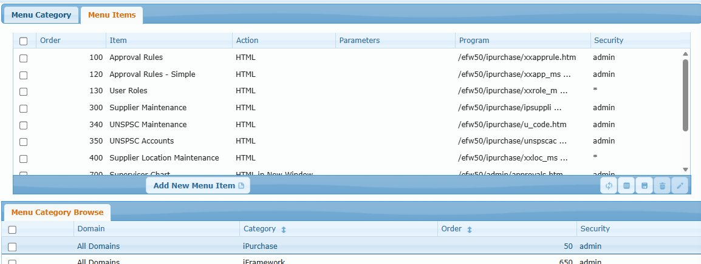
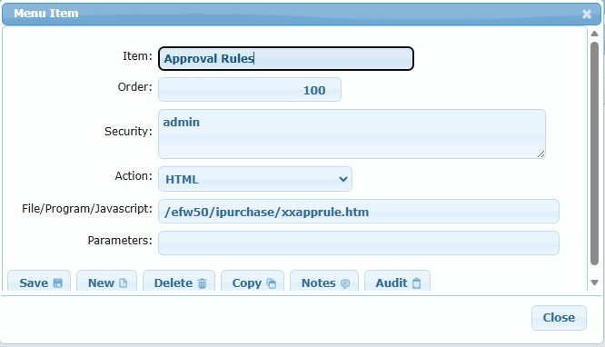

# Menu Maintenance

## Overview

Menu Maintenance configures the navigation menu system for all iFramework-based applications. This includes iPurchase, iApprove, iRFQ, iPortal, iQuote, and other modules built on the iFramework platform.

The menu system has two levels:
1. **Menu Categories** - Top-level menu items (e.g., iPurchase, Administration, iFramework)
2. **Menu Items** - Individual screens/programs within each category

Users only see menu categories and items they have security access to. For example, a user logging into iApprove would see the iApprove menu but not iPurchase (unless they have access to both).

## Access Path

iFramework → Menu Maintenance

## Screenshots

### Menu Category Tab

### Menu Items Tab

### Menu Item Dialog

---

## Tab: Menu Category

Defines top-level menu categories (the expandable sections in the left navigation).

### Form Fields

| Field | Description |
|-------|-------------|
| **Domain** | Domain this category applies to ("All Domains" or specific) |
| **Category** | Category name displayed in menu (e.g., iPurchase, iApprove) |
| **Order** | Sort order - lower numbers appear higher in menu |
| **Security** | Can-Do list of users/groups who can see this category. `*` = everyone, `admin` = admin group only |

### Browse Columns

| Column | Description |
|--------|-------------|
| Domain | Domain filter |
| Category | Category name |
| Order | Sort sequence |
| Security | Access control list |

### Example Categories

| Category | Order | Security | Description |
|----------|-------|----------|-------------|
| iPurchase | 50 | admin | Requisition/PO management |
| iApprove | 200 | * | Approval interface (all users) |
| iQuote | 450 | * | Quoting system |
| iPortal | 550 | admin | Portal administration |
| Administration | 600 | admin | System administration |
| iFramework | 650 | admin | Developer tools |
| iRFQ | 560 | * | Request for Quote |

---

## Tab: Menu Items

Defines individual menu items within each category.

### Browse Columns

| Column | Description |
|--------|-------------|
| Order | Sort order within category |
| Item | Display name in menu |
| Action | Type of action (HTML, JavaScript, etc.) |
| Parameters | Optional parameters passed to program |
| Program | Path to HTML file or program |
| Security | Access control list |

### Menu Item Dialog Fields

| Field | Description |
|-------|-------------|
| **Item** | Display name shown in menu |
| **Order** | Sort order within category (lower = higher position) |
| **Security** | Can-Do list for access control |
| **Action** | Type: HTML, HTML in New Window, JavaScript, etc. |
| **File/Program/Javascript** | Path to the program file (e.g., `/efw50/ipurchase/xxapprule.htm`) |
| **Parameters** | Optional URL parameters |

### Example Menu Items (iPurchase category)

| Order | Item | Program | Security |
|-------|------|---------|----------|
| 100 | Approval Rules | /efw50/ipurchase/xxapprule.htm | admin |
| 120 | Approval Rules - Simple | /efw50/ipurchase/xxapp_ms... | admin |
| 130 | User Roles | /efw50/ipurchase/xxrole_m... | * |
| 300 | Supplier Maintenance | /efw50/ipurchase/ipsuppli... | admin |
| 340 | UNSPSC Maintenance | /efw50/ipurchase/u_code.htm | admin |
| 350 | UNSPSC Accounts | /efw50/ipurchase/unspscac... | admin |
| 400 | Supplier Location Maintenance | /efw50/ipurchase/xxloc_ms... | * |
| 700 | Supervisor Chart | /efw50/admin/approvals.htm | admin |

---

## Action Buttons

| Button | Action |
|--------|--------|
| **Save** | Saves the category or item |
| **New** | Creates a new record |
| **Delete** | Deletes the selected record |
| **Copy** | Duplicates the record |
| **Notes** | Add documentation notes |
| **Audit** | View change history |
| **Add New Menu Item** | Quick add for menu items (on Menu Items tab) |

---

## Security (Can-Do Format)

The Security field uses [Can-Do list format](../../reference/can-do-list-format.md):

| Value | Meaning |
|-------|---------|
| `*` | Everyone can see this item |
| `admin` | Only users in "admin" group |
| `frank,peter` | Only users frank and peter |
| `!guest,*` | Everyone except guest |
| `admin,buyers` | Users in admin OR buyers group |

---

## Tips

1. **Order numbers** - Use gaps (50, 100, 150) to allow inserting items later
2. **Security inheritance** - Users must have access to BOTH category AND item to see a menu option
3. **Test as user** - Log in as different users to verify menu visibility
4. **Domain-specific menus** - Create domain-specific categories for multi-company setups

---

## Related Documentation

- [Can-Do List Format](../../reference/can-do-list-format.md) - Security field syntax
