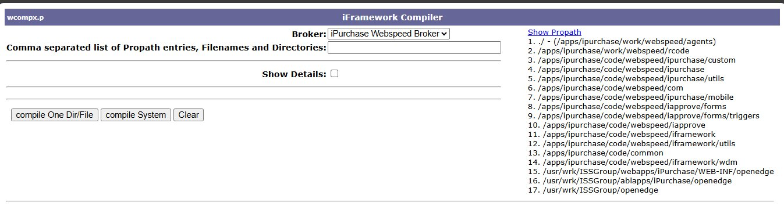

# Compiler

## Overview

The iFramework Compiler compiles OpenEdge/Progress ABL source code (.p, .w files) into r-code for the selected broker or app server. This is a developer tool used after making code changes.

**Note:** This is a developer tool for compiling Progress/OpenEdge code.

## Access Path

iFramework → Compiler

## Screenshot

---

## Fields

| Field | Description |
|-------|-------------|
| **Broker** | Select target broker/app server to compile for (e.g., iPurchase Webspeed Broker, demo1 App Server) |
| **Propath entries, Filenames and Directories** | Comma-separated list of specific files or directories to compile |
| **Show Details** | Checkbox to display detailed compilation output |

---

## Buttons

| Button | Description |
|--------|-------------|
| **compile One Dir/File** | Compile only the specified directory or file |
| **compile System** | Compile entire system using the displayed Propath |
| **Clear** | Clear the output/input fields |

---

## Show Propath

Displays the current Propath configuration for the selected broker - the list of directories searched for source code and includes:

- `/apps/ipurchase/work/webspeed/agents`
- `/apps/ipurchase/work/webspeed/rcode`
- `/apps/ipurchase/code/webspeed/ipurchase/custom`
- `/apps/ipurchase/code/webspeed/ipurchase`
- And more...

---

## Use Cases

- **After code changes** - Recompile modified .p or .w files
- **Deployment** - Compile entire system after updates
- **Troubleshooting** - Verify code compiles without errors

---

## Tips

1. **Select correct broker** - Each broker may have different Propath settings
2. **compile System** takes time - Use for full deployments only
3. **Check Show Details** - To see compilation errors if something fails
4. **Directory order** - When entering multiple directories, enter them in reverse order
