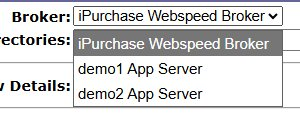

# Query Tester

## Overview

Query Tester is the testing interface for `getData.p`, the core data retrieval procedure used by all iFramework screens. This tool allows developers and trained administrators to run ad-hoc queries against the database using the same parameters that screens use internally.

**⚠️ Warning:** This is a powerful developer tool. End customers should NOT have access to this screen - only trained administrators and developers.

## Access Path

iFramework → Query Tester

## Screenshot

---

## Parameters

### Left Column

| Field | Description |
|-------|-------------|
| **DSName** | Dataset name (table/view to query) |
| **OutputFormat** | Output format: XML, JSON, etc. |
| **includeSchema** | Include schema definition in output |
| **DictDb** | Dictionary database |
| **WhereClause** | WHERE clause for filtering (e.g., `wus_id eq 'frank'`) |
| **minSchema** | Return minimal schema |
| **Compress** | Compress output |
| **Formatted** | Format output for readability |
| **NoLabels** | Exclude field labels |
| **NumRecords** | Maximum records to return |
| **FieldSet** | Specific fields to return |

### Right Column

| Field | Description |
|-------|-------------|
| **XSLFile** | XSL transformation file |
| **Delimiter** | Field delimiter for output |
| **NavDirection** | Navigation direction for paging |
| **NavRowids** | Row IDs for navigation |
| **Rowid** | Specific row ID to retrieve |
| **filter** | Additional filter criteria |
| **sort** | Sort order |
| **dir** | Sort direction |
| **query** | Query string |
| **queryFields** | Fields to include in query |
| **getIndexForTable** | Get index information for table |

---

## Buttons

| Button | Description |
|--------|-------------|
| **Search** | Execute the query with specified parameters |

---

## Use Cases

- **Testing getData.p calls** - Verify parameters before using in code
- **Debugging screens** - Reproduce what a screen is requesting
- **Ad-hoc data queries** - Quick data lookup without writing code
- **Schema exploration** - Check field names and types

---

## Tips

1. **Security** - Restrict access to developers and trained admins only
2. **DSName** - Use the same dataset names that screens use (check screen source)
3. **WhereClause syntax** - Uses Progress query syntax (eq, ne, gt, lt, etc.)
4. **NumRecords** - Always set a limit to avoid returning massive result sets
