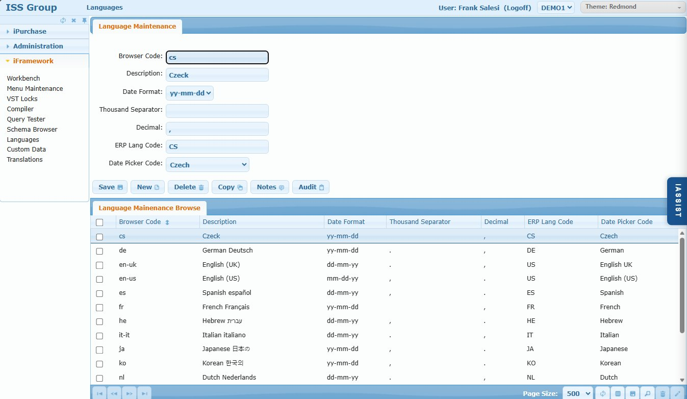

# Languages

## Overview

The Languages screen configures language settings for the iFramework application. This defines how dates, numbers, and other locale-specific values are formatted for each supported language.

Users can select their preferred language in their profile, and the system will display dates and numbers according to that language's settings.

## Access Path

iFramework → Languages

## Screenshot

---

## Form Fields

| Field | Description |
|-------|-------------|
| **Browser Code** | Language code used by browser (e.g., `en-us`, `de`, `fr`, `cs`) |
| **Description** | Language name (e.g., English (US), German Deutsch, Czech) |
| **Date Format** | Date display format: `mm-dd-yy`, `dd-mm-yy`, `yy-mm-dd` |
| **Thousand Separator** | Character for thousands grouping (e.g., `,` or `.` or space) |
| **Decimal** | Decimal separator (e.g., `.` or `,`) |
| **ERP Lang Code** | Corresponding language code in QAD ERP (e.g., US, DE, FR, CS) |
| **Date Picker Code** | Language for the date picker control |

---

## Browse Columns

| Column | Description |
|--------|-------------|
| Browser Code | Language identifier |
| Description | Language name |
| Date Format | Date display format |
| Thousand Separator | Thousands grouping character |
| Decimal | Decimal separator |
| ERP Lang Code | QAD language code |
| Date Picker Code | Date picker language |

---

## Action Buttons

| Button | Action |
|--------|--------|
| **Save** | Saves the language configuration |
| **New** | Creates a new language |
| **Delete** | Deletes the selected language |
| **Copy** | Duplicates the language |
| **Notes** | Add documentation notes |
| **Audit** | View change history |

---

## Database Table

**Table: `xxlang_mstr`**

---

## Pre-configured Languages

| Code | Description | Date Format | ERP Code |
|------|-------------|-------------|----------|
| cs | Czech | yy-mm-dd | CS |
| de | German Deutsch | yy-mm-dd | DE |
| en-uk | English (UK) | dd-mm-yy | US |
| en-us | English (US) | mm-dd-yy | US |
| es | Spanish español | dd-mm-yy | ES |
| fr | French Français | yy-mm-dd | FR |
| he | Hebrew עברית | dd-mm-yy | HE |
| it-it | Italian italiano | dd-mm-yy | IT |
| ja | Japanese 日本の | yy-mm-dd | JA |
| ko | Korean 한국의 | yy-mm-dd | KO |
| nl | Dutch Nederlands | dd-mm-yy | NL |

---

## Tips

1. **Browser detection** - System matches browser language preference to find appropriate settings
2. **Date formats** - US uses mm-dd-yy, Europe typically uses dd-mm-yy, Asia often uses yy-mm-dd
3. **Number formats** - US uses comma for thousands (1,000.00), Europe often uses period (1.000,00)

---

## Related Screens

- [Translations](./iframework-08-translations.md) - Translate UI text for each language
