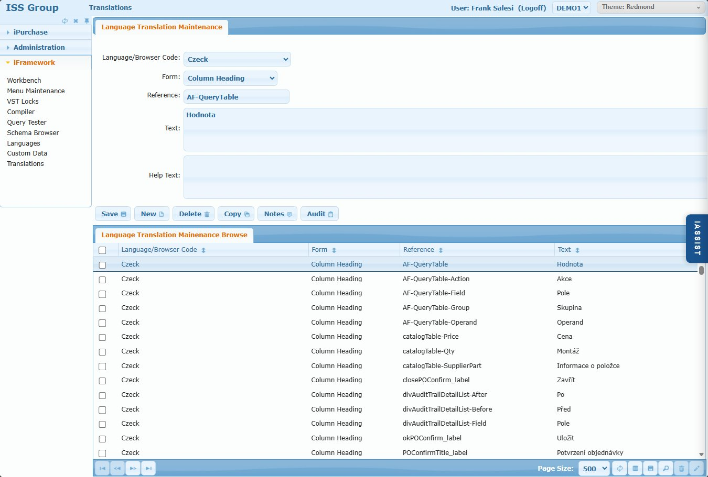

# Translations

## Overview

The Translations screen manages language translations for all UI elements across iFramework applications. This allows the system to display labels, headings, messages, and help text in multiple languages based on the user's browser language setting.

## Access Path

iFramework → Translations

## Screenshot

---

## Form Fields

| Field | Description |
|-------|-------------|
| **Language/Browser Code** | Language code (e.g., Czeck, Spanish, French) |
| **Form** | Category of UI element being translated (Column Heading, Global Label, Requisition Workbench, etc.) |
| **Reference** | Specific UI element identifier (e.g., AF-QueryTable, catalogTable-Price) |
| **Text** | Translated text to display |
| **Help Text** | Translated help/tooltip text |

---

## Form Categories

| Form | Description |
|------|-------------|
| Column Heading | Grid/table column headers |
| Global Label | Common labels used across screens |
| Requisition Workbench | Requisition entry screen labels |
| Requisition Inquiry | Requisition lookup screen |
| Requisition Print | Print-related labels |
| Budget Maintenance | Budget screen labels |
| Catalog | Catalog/punchout labels |
| Application Message | System messages and alerts |
| Miscellaneous | Other UI elements |

---

## Browse Columns

| Column | Description |
|--------|-------------|
| Language/Browser Code | Language identifier |
| Form | UI category |
| Reference | Element identifier |
| Text | Translated text |

---

## Action Buttons

| Button | Action |
|--------|--------|
| **Save** | Save the translation |
| **New** | Create new translation |
| **Delete** | Delete selected translation |
| **Copy** | Duplicate translation (useful for new languages) |
| **Notes** | Add notes |
| **Audit** | View change history |

---

## Database Table

**Table: `xxlangd_det`**

Stores all translation records with language code, form category, reference identifier, and translated text.

---

## How It Works

1. User's browser sends language preference (e.g., `cs` for Czech)
2. System looks up translations in `xxlangd_det` for that language
3. If translation exists, displays translated text
4. If no translation, falls back to English default

---

## Tips

1. **Reference consistency** - Use exact reference names from the base English UI
2. **Copy for new languages** - Copy existing translations and update the language code
3. **Test thoroughly** - Some languages have longer text that may affect UI layout
4. **Column Headings first** - Start with column headings as they're most visible

---

## Related Screens

- [Languages](./iframework-07-languages.md) - Configure available languages
