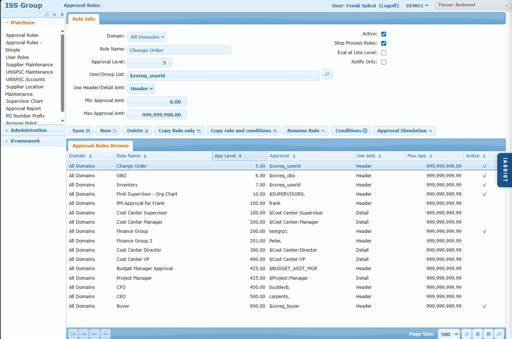
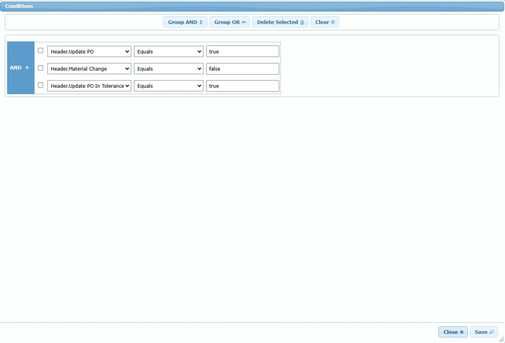
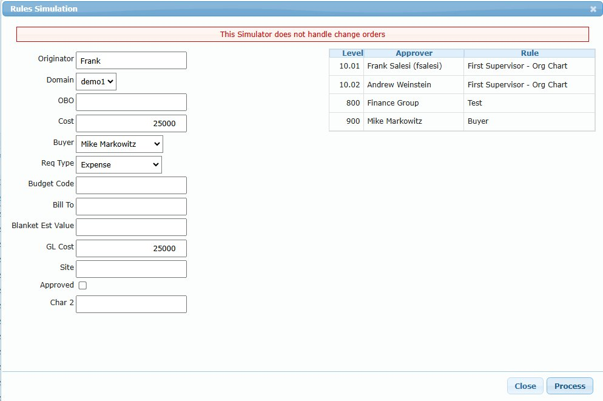
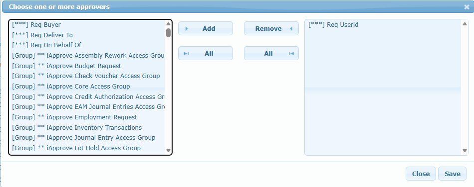

# Approval Rules (Complex)

## Overview

The Approval Rules screen manages complex approval rules that support nested AND/OR conditional logic. Use this screen when approval routing requires logic that cannot be expressed with simple AND conditions.

iPurchase has two approval rule systems that work together:
1. **Complex Rules (this screen)** - Nested AND/OR conditions, stored in `xxAppRule` + `xxAppField`
2. **Simple Rules** - Straightforward AND-based logic, stored in `xxapp_mstr`

Both systems share a common sequence number space ("App Level") and are evaluated together to determine the complete approval routing for a requisition.

**Use Complex Rules when you need:**
- OR logic: "Type is Expense OR Capital"
- Nested conditions: "(Bill-to is 10000 OR user is Admin) AND (Type is Expense OR Amount > $5000)"
- Line-by-line approval with different approver per line
- Variable substitution in conditions
- Validation rules that block submission

## Access Path

iPurchase → Approval Rules

## Screenshots









## Screen Layout

The screen consists of:

1. **Rule Info Tab** - Rule header configuration
2. **Approval Rules Browse** - Grid listing all complex rules

---

## Rule Info Tab

### Field: Domain

- **Type**: Dropdown
- **Required**: Yes
- **Options**: "All Domains" or specific domain code
- **Description**: Which domain(s) this rule applies to. "All Domains" applies the rule globally.

### Field: Rule Name

- **Type**: Text input
- **Required**: Yes
- **Description**: Unique identifier for the rule. Use descriptive names that explain the rule's purpose.
- **Examples**: `Change Order`, `OBO`, `Cost Center Manager`, `CFO`

### Field: Approval Level

- **Type**: Numeric
- **Required**: Yes
- **Description**: Sequence number determining when this rule is evaluated. Lower numbers are evaluated first. This sequence is shared with Simple Rules.
- **Guidelines**:
  - Negative numbers (-990, -980, etc.): Validation rules
  - 1-10: Special rules (Change Order, OBO)
  - 100-899: Business approval rules
  - 900+: Final approvals (Buyer)

### Field: User/Group List

- **Type**: Text with lookup
- **Required**: Yes
- **Description**: Who must approve when this rule triggers. Click the magnifying glass to open the approver picker.
- **Options**:
  - **User ID**: Direct user (e.g., `frank`)
  - **Group**: Any group member can approve (e.g., `buyers`)
  - **Special Variables**: Dynamic resolution at runtime (see Special Approver Variables below)
  - **User Role Variables**: `$Cost Center:Manager`, `$Account:Director`, etc. (see [User Roles](./ipurchase-03-user-roles.md))
  - **Validation Message**: `MESSAGE:Error text here` (blocks submission)
  - **Can-Do List**: Comma-separated list of any of the above

### Field: Use Header/Detail Amt

- **Type**: Dropdown
- **Options**: Header, Detail
- **Description**: How to calculate the amount for threshold comparison
  - **Header**: Use total requisition amount (`xxreq_cost_gl`), even if only some lines match conditions
  - **Detail**: Sum only the lines that match the rule's conditions (`xxreqd_total_gl`)

**Example:**
```
Requisition:
  Line 1: $5,000 to CC 8100
  Line 2: $3,000 to CC 8200
  Total: $8,000

Rule: CC=8100, Min=$4K

Header mode: Compares $8,000 (total) against $4K threshold
Detail mode: Compares $5,000 (only CC 8100 lines) against $4K threshold
```

### Field: Min Approval Amt

- **Type**: Numeric
- **Description**: Minimum amount threshold. Rule only triggers if amount >= this value.
- **Default**: 0.00

### Field: Max Approval Amt

- **Type**: Numeric
- **Description**: Maximum amount threshold. Rule only triggers if amount <= this value.
- **Default**: 999,999,998.00 (effectively unlimited)

### Field: Active

- **Type**: Checkbox
- **Description**: Whether the rule is currently in use. Inactive rules are ignored during evaluation.

### Field: Stop Process Rules

- **Type**: Checkbox
- **Description**: If checked, stops all further rule evaluation after this rule triggers. Rules with higher sequence numbers are skipped.
- **Use Case**: Change Order rule uses Stop to bypass normal approval chain

### Field: Eval at Line Level

- **Type**: Checkbox
- **Description**: If checked, creates separate approval records for each matching line. Approver variable should typically vary by line (e.g., `$Cost Center:Manager`).
- **Use Case**: Different cost center managers approve their respective lines

### Field: Notify Only

- **Type**: Checkbox
- **Description**: If checked, this is a notification rule, not an approval rule. Recipients are CC'd on the PO email but don't need to approve.
- **Evaluation**: Notification rules are only processed after the requisition is fully approved and converted to a PO.

---

## Action Buttons

### Button: Save

- **Action**: Saves the rule configuration

### Button: New

- **Action**: Clears form to create a new rule

### Button: Delete

- **Action**: Deletes the rule and all its conditions

### Button: Copy Rule only

- **Action**: Duplicates the rule header without conditions
- **Use Case**: Create similar rule with different conditions

### Button: Copy rule and conditions

- **Action**: Duplicates the rule header AND all xxAppField conditions
- **Use Case**: Create variant of existing rule

### Button: Rename Rule

- **Action**: Changes the rule name (updates xxAppField references automatically)

### Button: Conditions

- **Action**: Opens the Conditions editor to define AND/OR logic
- **See**: Conditions Editor section below

### Button: Approval Simulation

- **Action**: Opens the simulation tool to test approval routing
- **See**: Approval Simulation section below

---

## Conditions Editor

The Conditions editor provides a visual interface for building AND/OR conditional logic.


### Interface Elements

- **Group AND button**: Creates an AND group (all conditions must be true)
- **Group OR button**: Creates an OR group (at least one condition must be true)
- **Delete Selected button**: Removes selected conditions
- **Clear button**: Removes all conditions

### Building Conditions

1. Click **Group AND** or **Group OR** to create the root operator
2. Within the group, add conditions using the dropdowns:
   - **Field**: Select from Header or Detail fields (e.g., `Header.Update PO`, `Detail.Cost Center`)
   - **Operator**: Equals, Not Equals, Greater Than, Less Than, Can-Do, In List, etc.
   - **Value**: The comparison value (can include variables like `$xxreq_obo`)
3. Nest groups by selecting conditions and clicking Group AND/OR

### Example: Change Order Rule

```
AND (all must be true):
  ├─ Header.Update PO = true
  ├─ Header.Material Change = false
  └─ Header.Update PO In Tolerance = true
```

This rule triggers only when: it's a change order AND not a material change AND within tolerance limits.

### Example: Nested OR Logic

```
AND:
  ├─ OR:
  │   ├─ Header.Bill To = 10000
  │   └─ Header.Userid Can-Do "Admin"
  │
  └─ OR:
      ├─ Header.Type In List "Expense,Capital"
      └─ Header.GL Cost >= 5000
```

This rule triggers when: (Bill-to is 10000 OR user is Admin) AND (Type is Expense/Capital OR amount >= $5000)

---

## Approval Simulation

The Approval Simulation tool tests how rules will route a hypothetical requisition.


### Input Fields

The simulation form displays every field used in any rule condition:
- Originator, Domain, OBO, Cost, Buyer, Req Type
- Budget Code, Bill To, Blanket Est Value, GL Cost, Site
- Any custom fields referenced in conditions

### Process

1. Fill in the sample requisition values
2. Click **Process**
3. View the resulting approval chain showing:
   - **Level**: Sequence number (with decimal for line-level)
   - **Approver**: Resolved user name
   - **Rule**: Which rule added this approver

### Note

The simulation does not handle change orders (as shown in the warning banner). Test change order routing with actual change order requisitions.

---

## User/Group Picker

Click the magnifying glass next to User/Group List to open the approver picker.


### Available Options

| Prefix | Type | Description |
|--------|------|-------------|
| `[***]` | Special Variable | Built-in variables resolved at runtime |
| `[Group]` | Group | Any member of the group can approve |
| (none) | User | Direct user ID |

### Special Variables `[***]`

| Variable | Resolves To |
|----------|-------------|
| `Req Buyer` | `$xxreq_buyer` - Assigned buyer |
| `Req Deliver To` | `$xxreq_deliver_to` - Delivery recipient |
| `Req On Behalf Of` | `$xxreq_obo` - Budget owner |
| `Req Userid` | `$xxreq_userid` - Requisition creator |

### User Role Variables

Variables like `$Cost Center:Manager` are defined in the [User Roles](./ipurchase-03-user-roles.md) screen. These dynamically resolve based on field values:

| Variable | Meaning |
|----------|---------|
| `$Cost Center:Manager` | Manager for the cost center on the line |
| `$Cost Center:Director` | Director for the cost center |
| `$Account:Director` | Director for the GL account |
| `$Project:Manager` | Manager for the project code |
| `$Site:Manager` | Manager for the site |

---

## Special Approver Variables

### Supervisor Chain Variables

| Variable | Behavior |
|----------|----------|
| `$SUPERVISORS` | All supervisors up chain until one has sufficient approval limit |
| `$FIRST_SUPERVISOR` | Immediate supervisor only (ignores approval limits) |
| `$LAST_SUPERVISOR` | Skip to supervisor with sufficient approval limit |

### Requisition Field Variables

| Variable | Field |
|----------|-------|
| `$xxreq_userid` | Requisition creator |
| `$xxreq_obo` | On Behalf Of person |
| `$xxreq_buyer` | Assigned buyer |

### Validation Messages

Start the approver field with `MESSAGE:` to create a validation rule:
```
MESSAGE:Cost center 8100 requires a project code
```
If conditions match, submission is blocked and this message is displayed.

---

## Approval Rules Browse

### Browse Columns

| Column | Description |
|--------|-------------|
| Domain | "All Domains" or specific domain |
| Rule Name | Unique rule identifier |
| App Level | Sequence number |
| Approver | User/Group/Variable |
| Use Amt | Header or Detail |
| Max App | Maximum amount threshold |
| Active | Whether rule is active (✓) |

---

## Default Rules

Every iPurchase implementation includes these default rules:

### Change Order (Seq 5)

- **Purpose**: Quick approval for minor PO modifications within tolerance
- **Approver**: `$xxreq_userid` (typically the buyer)
- **Stop**: Yes (bypasses all other rules)
- **Conditions**: Update PO = true AND Material Change = false AND Within Tolerance = true

### OBO (Seq 6)

- **Purpose**: Route to On Behalf Of person when different from creator
- **Approver**: `$xxreq_obo`
- **Stop**: No
- **Conditions**: `xxreq_userid` not equal to `$xxreq_obo`

### Buyer (Seq 900)

- **Purpose**: Final purchasing review before PO creation
- **Approver**: `$xxreq_buyer`
- **Stop**: No
- **Conditions**: None (always triggers)

---

## Rule Evaluation Flow

```
1. User submits requisition
           ↓
2. Validation rules (negative sequence) checked first
   - If any match → Block submission with MESSAGE
           ↓
3. Complex rules (xxAppRule) evaluated in sequence order
   - If Stop = true → Record stop sequence, skip remaining complex rules
           ↓
4. Simple rules (xxapp_mstr) evaluated up to stop sequence
   - If Stop = true → Delete any complex rule approvers with higher sequence
           ↓
5. Notification rules skipped (evaluated later after PO creation)
           ↓
6. Final approval chain assembled
           ↓
7. Duplicate handling applied (per MULTIPLE_APPROVALS setting)
           ↓
8. Requisition enters approval workflow
```

---

## Business Rules

1. **Shared sequence space** - Complex and Simple rules share the same sequence numbers
2. **Complex rules first** - At any given sequence, complex rules are evaluated before simple rules
3. **Stop affects both systems** - A stop in either system affects the other
4. **Active flag** - Only active rules are evaluated
5. **Domain filtering** - Rules must match "All Domains" or the specific requisition domain

---

## Tips & Best Practices

1. **Use descriptive rule names** - "Cost Center Manager for Expense" is better than "Rule 5"
2. **Document complex conditions** - Use Notes to explain business logic in plain language
3. **Test with Approval Simulation** - Verify routing before activating rules
4. **Reserve low sequences** - Keep 1-10 for special rules like Change Order
5. **Use Simple Rules when possible** - Complex rules are harder to maintain
6. **Leave sequence gaps** - Use increments of 50 or 100 for easy insertion

---

## Related Screens

- [Approval Rules - Simple](./ipurchase-02-approval-rules-simple.md) - Simple AND-based rules
- [User Roles](./ipurchase-03-user-roles.md) - Define role-based approvers by cost center, account, project, etc.
- [Supervisor Chart](./ipurchase-08-supervisor-chart.md) - View organizational hierarchy
- [Approval Report](./ipurchase-09-approval-report.md) - Report on approval rule configuration
