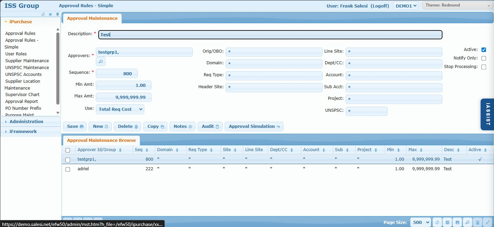

# Approval Rules - Simple

## Overview

The Approval Rules - Simple screen manages straightforward AND-based approval rules. This is the recommended approach for most approval scenarios as rules are easier to create, understand, and maintain.

iPurchase has two approval rule systems that work together:
1. **Simple Rules (this screen)** - AND-based logic, stored in `xxapp_mstr`
2. **Complex Rules** - Nested AND/OR conditions, stored in `xxAppRule` + `xxAppField`

Both systems share a common sequence number space and are evaluated together to determine the complete approval routing for a requisition.

**Use Simple Rules when:**
- All conditions can be expressed with AND logic (all must be true)
- No need for OR conditions or nested logic
- No need for line-by-line approval with different approvers per line
- Rule logic is straightforward and easy to explain

**Use Complex Rules when you need:**
- OR logic or nested conditions
- Line-by-line approval generation
- Variable substitution in conditions
- Validation rules that block submission

## Access Path

iPurchase → Approval Rules - Simple

## Screenshot



## Screen Layout

The screen consists of:

1. **Approval Maintenance** - Rule configuration form
2. **Approval Maintenance Browse** - Grid listing all simple rules

---

## Approval Maintenance Form

### Field: Description

- **Type**: Text input
- **Required**: Yes
- **Description**: Descriptive name for the rule. Should clearly explain when the rule applies.
- **Examples**: `Cost Center Manager`, `Finance Director over $50K`, `Capital Equipment Approval`

### Field: Approvers

- **Type**: Text with lookup
- **Required**: Yes
- **Description**: Who must approve when this rule triggers. Click the magnifying glass to open the approver picker.
- **Options**:
  - **User ID**: Direct user (e.g., `frank`)
  - **Group**: Any group member can approve (e.g., `buyers`)
  - **Special Variables**: `$xxreq_buyer`, `$xxreq_obo`, `$xxreq_userid`
  - **User Role Variables**: `$Cost Center:Manager`, `$Project:Manager`, etc.
  - **Can-Do List**: Comma-separated list of any of the above

### Field: Sequence

- **Type**: Numeric
- **Required**: Yes
- **Description**: Sequence number determining evaluation order. Lower numbers are evaluated first. This sequence is shared with Complex Rules.
- **Guidelines**:
  - 1-10: Reserved for special rules (Change Order, OBO)
  - 100-899: Business approval rules
  - 900+: Final approvals (Buyer)
  - Leave gaps (use increments of 50 or 100) for easy insertion

### Field: Min Amt

- **Type**: Numeric
- **Description**: Minimum amount threshold. Rule only triggers if amount >= this value.
- **Default**: 0.00 or 1.00

### Field: Max Amt

- **Type**: Numeric
- **Description**: Maximum amount threshold. Rule only triggers if amount <= this value.
- **Default**: 9,999,999.99 (effectively unlimited)

### Field: Use

- **Type**: Dropdown
- **Options**: Total Req Cost, Total Line Cost
- **Description**: How to calculate the amount for threshold comparison
  - **Total Req Cost** (Header): Use total requisition amount (`xxreq_cost_gl`)
  - **Total Line Cost** (Detail): Sum only lines matching the filter conditions

**Example:**
```
Requisition:
  Line 1: $5,000 to CC 8100
  Line 2: $3,000 to CC 8200
  Total: $8,000

Rule: Dept/CC = 8100, Min Amt = $4K

Total Req Cost: Compares $8,000 (total) against $4K → Triggers
Total Line Cost: Compares $5,000 (only CC 8100 lines) against $4K → Triggers
```

---

## Filter Fields (Right Side)

All filter fields use **Can-Do list** format. A rule triggers only when ALL filter conditions match (AND logic).

### Field: Orig/OBO

- **Description**: Filter by originator or On Behalf Of person
- **Format**: Can-Do list of user IDs or group IDs
- **Default**: `*` (any)
- **Example**: `frank,buyers` (matches frank OR anyone in buyers group)

### Field: Domain

- **Description**: Which domain(s) this rule applies to
- **Format**: Can-Do list or `*` for all domains
- **Default**: `*`

### Field: Req Type

- **Description**: Filter by requisition type
- **Format**: Can-Do list of requisition types
- **Default**: `*` (any)
- **Example**: `Expense,Capital` (matches Expense OR Capital)

### Field: Header Site

- **Description**: Filter by PO site (header level)
- **Format**: Can-Do list
- **Default**: `*`

### Field: Line Site

- **Description**: Filter by line item site
- **Format**: Can-Do list
- **Default**: `*`

### Field: Dept/CC

- **Description**: Filter by cost center/department
- **Format**: Can-Do list
- **Default**: `*`
- **Example**: `8100,8200` or `81*` (any starting with 81)

### Field: Account

- **Description**: Filter by GL account
- **Format**: Can-Do list
- **Default**: `*`

### Field: Sub Acct

- **Description**: Filter by sub-account
- **Format**: Can-Do list
- **Default**: `*`

### Field: Project

- **Description**: Filter by project code
- **Format**: Can-Do list
- **Default**: `*`

### Field: UNSPSC

- **Description**: Filter by UNSPSC commodity code
- **Format**: Can-Do list
- **Default**: `*`

---

## Checkboxes

### Field: Active

- **Type**: Checkbox
- **Description**: Whether the rule is currently in use. Inactive rules are ignored during evaluation.

### Field: Notify Only

- **Type**: Checkbox
- **Description**: If checked, this is a notification rule, not an approval rule. Recipients are CC'd on the PO email but don't need to approve.
- **Evaluation**: Notification rules are only processed after the requisition is fully approved and converted to a PO.

### Field: Stop Processing

- **Type**: Checkbox
- **Description**: If checked, stops all further rule evaluation after this rule triggers. Rules with higher sequence numbers (both Simple and Complex) are skipped.

---

## Action Buttons

| Button | Action |
|--------|--------|
| **Save** | Saves the rule configuration |
| **New** | Clears form to create a new rule |
| **Delete** | Deletes the selected rule |
| **Copy** | Duplicates the rule with a new sequence number |
| **Notes** | Add documentation notes to the rule |
| **Audit** | View change history for this rule |
| **Approval Simulation** | Test approval routing with sample data |

---

## Approval Maintenance Browse

### Browse Columns

| Column | Description |
|--------|-------------|
| Approver Id/Group | User, group, or variable |
| Seq | Sequence number |
| Domain | Domain filter (`*` = all) |
| Req Type | Requisition type filter |
| Site | Header site filter |
| Line Site | Line site filter |
| Dept/CC | Cost center filter |
| Account | GL account filter |
| Sub | Sub-account filter |
| Project | Project filter |
| Min | Minimum amount |
| Max | Maximum amount |
| Desc | Rule description |
| Active | Active indicator (✓) |

---

## Can-Do List Format

For complete documentation, see [Can-Do List Format Reference](../../reference/can-do-list-format.md).

Quick reference:

Simple Rules use Can-Do list format for all filter fields:

| Pattern | Meaning |
|---------|---------|
| `*` | Match anything |
| `8100` | Match exactly 8100 |
| `8100,8200` | Match 8100 OR 8200 |
| `81*` | Match anything starting with 81 |
| `!8100` | Exclude 8100 |
| `!8100,81*` | Match anything starting with 81 EXCEPT 8100 |

**Evaluation**: Left-to-right, first match wins.

---

## Rule Evaluation Flow

Simple Rules are evaluated together with Complex Rules:

```
1. User submits requisition
           ↓
2. Complex Rules (xxAppRule) evaluated first by sequence
   - If Stop = true → Record stop sequence
           ↓
3. Simple Rules (xxapp_mstr) evaluated by sequence
   - Only rules with sequence <= stop sequence
   - If Stop = true → Delete higher-sequence approvers
           ↓
4. Notification rules skipped (evaluated after PO creation)
           ↓
5. Final approval chain assembled
           ↓
6. Duplicate handling applied (per MULTIPLE_APPROVALS setting)
```

**Key Points:**
- Both rule systems share the same sequence number space
- A stop in either system affects both systems
- Complex rules at same sequence are evaluated before simple rules

---

## Examples

### Example 1: Cost Center Manager Approval

```
Description: Cost Center Manager
Approvers:   $Cost Center:Manager
Sequence:    100
Min Amt:     1.00
Max Amt:     9,999,999.99
Use:         Total Line Cost
Dept/CC:     *
Active:      ✓
```

This rule adds the cost center manager for each unique cost center on the requisition.

### Example 2: Finance Director for Large Expenses

```
Description: Finance Director over $50K
Approvers:   finance_director
Sequence:    300
Min Amt:     50,000.00
Max Amt:     9,999,999.99
Use:         Total Req Cost
Req Type:    Expense
Active:      ✓
```

This rule adds the Finance Director for any Expense requisition over $50,000.

### Example 3: Capital Equipment Approval

```
Description: Capital Equipment over $10K
Approvers:   capital_approvers
Sequence:    250
Min Amt:     10,000.00
Max Amt:     9,999,999.99
Use:         Total Req Cost
Req Type:    Capital
Account:     82*
Active:      ✓
```

This rule triggers for Capital requisitions over $10K using any account starting with 82.

---

## Tips & Best Practices

1. **Use descriptive names** - "Cost Center Manager for Expense over $5K" is better than "Rule 100"
2. **Leave sequence gaps** - Use increments of 50 or 100 for easy insertion later
3. **Start with Simple Rules** - Only use Complex Rules when AND logic is insufficient
4. **Test with Approval Simulation** - Verify routing before activating rules
5. **Document with Notes** - Explain the business requirement behind the rule
6. **Use `*` wisely** - Overly broad rules can cause unexpected routing

---

## Simple vs Complex Rules Comparison

| Feature | Simple Rules | Complex Rules |
|---------|--------------|---------------|
| Logic | AND only | AND/OR nested |
| Conditions | Filter fields | Tree builder |
| Line-by-line eval | No | Yes (optional) |
| Validation rules | No | Yes (MESSAGE:) |
| Ease of use | Easy | Complex |
| Maintenance | Simple | Harder to understand |
| Database | xxapp_mstr | xxAppRule + xxAppField |

---

## Related Screens

- [Approval Rules (Complex)](./ipurchase-01-approval-rules.md) - AND/OR conditional approval routing
- [User Roles](./ipurchase-03-user-roles.md) - Define role-based approvers
- [System Settings](./02-system-settings.md) - Approval-related settings

---

## Related System Settings

See [Approval Workflow Settings](../../reference/system-settings-reference.md#approval-workflow) for settings that affect rule evaluation:

- **MULTIPLE_APPROVALS** - How to handle duplicate approvers (keep_all, keep_first, keep_last)
- **AUTO_APPROVE_FORWARD** - Auto-approve future instances after first approval
- **ALLOW_SUPERVISORS_TO_APPROVE** - Who can approve for subordinates
