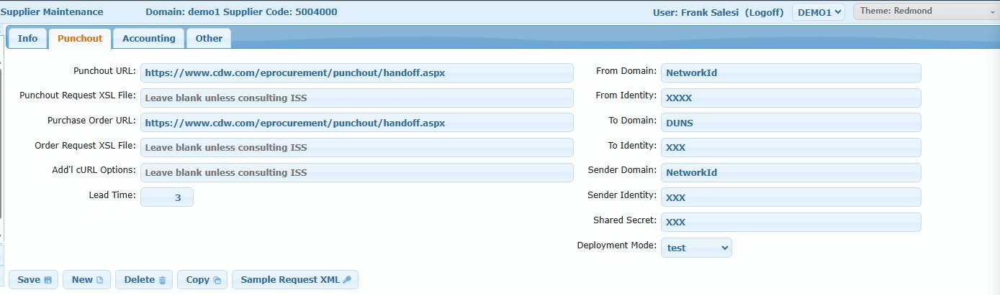

# Supplier Maintenance

## Overview

The Supplier Maintenance screen manages iPurchase-specific supplier/vendor records. These records extend QAD vendor data with iPurchase-specific features like:

- **Punchout catalog integration** - cXML connections to supplier websites (CDW, Grainger, Amazon Business, etc.)
- **Supplier logos** - Display branding in the catalog
- **Tax handling** - Ship-to/Bill-to configurations for tax scenarios
- **PO consolidation** - Batch PO creation options

**Note:** The Supplier Code typically matches the QAD vendor number but can be any unique identifier.

## Access Path

iPurchase → Supplier Maintenance

## Screenshots

### Info Tab


### Punchout Tab


## Screen Layout

The screen has four tabs:
1. **Info** - Basic supplier information and logo
2. **Punchout** - cXML punchout catalog configuration
3. **Accounting** - Tax-related ship-to/bill-to settings
4. **Other** - Batch PO options

Plus the standard **Supplier Maintenance Browse** grid.

---

## Info Tab

### Field: Domain

- **Type**: Text (read-only after creation)
- **Database**: `ipSupplier_domain`
- **Description**: The domain this supplier belongs to

### Field: Supplier Code

- **Type**: Text
- **Required**: Yes
- **Database**: `ipSupplier_code`
- **Description**: Unique identifier for the supplier. Typically matches the QAD vendor number.

### Field: Name

- **Type**: Text
- **Required**: Yes
- **Database**: `ipSupplier_name`
- **Description**: Display name for the supplier

### Field: Email

- **Type**: Text
- **Database**: `ipSupplier_email`
- **Description**: Contact email for the supplier

### Field: Choose Image

- **Type**: Dropdown
- **Description**: Select from pre-uploaded supplier logos stored on the server

### Field: Description

- **Type**: HTML text area
- **Database**: `ipSupplier_desc`
- **Description**: HTML content that can include an image tag for the supplier logo. Displays in the Preview area.

#### Adding a Custom Logo

If no pre-uploaded image exists for a supplier, you can add a logo using base64 encoding:

1. **Find the supplier's logo** - Search for the company logo online (e.g., "CDW logo png")
2. **Convert to base64** - Use an online tool like [base64-image.de](https://www.base64-image.de/) or similar:
   - Upload or paste the image URL
   - Copy the generated base64 string
3. **Create the img tag** - Enter in the Description field:
   ```html
   
   ```
4. **Important**: Always set `height` and `width` attributes to control the display size (typically 80x80px)

**Example:**
```html

```

Or with base64:
```html

```

---

## Punchout Tab

The Punchout tab configures cXML punchout catalog integration. This allows users to "punch out" to a supplier's website, shop in their catalog, and return items to iPurchase for requisition.

### Punchout Configuration Fields (Left Side)

#### Field: Punchout URL

- **Database**: `ipSupplier_PO_URL`
- **Description**: The supplier's cXML PunchOutSetupRequest endpoint URL
- **Example**: `https://www.cdw.com/eprocurement/punchout/handoff.aspx`

#### Field: Punchout Request XSL File

- **Database**: `ipSupplier_template`
- **Description**: Custom XSL transformation file for the punchout request. Leave blank unless consulting ISS.

#### Field: Purchase Order URL

- **Database**: `ipSupplier_Order_URL`
- **Description**: The supplier's cXML OrderRequest endpoint URL for sending POs electronically
- **Example**: `https://www.cdw.com/eprocurement/punchout/handoff.aspx`

#### Field: Order Request XSL File

- **Database**: `ipSupplier_order_template`
- **Description**: Custom XSL transformation file for order requests. Leave blank unless consulting ISS.

#### Field: Add'l cURL Options

- **Database**: `ipsupplier_curl`
- **Description**: Additional cURL options for the HTTP request. Leave blank unless consulting ISS.

#### Field: Lead Time

- **Database**: `ipSupplier_leadtime`
- **Description**: Default lead time in days for items from this supplier

### cXML Identity Fields (Right Side)

These fields are provided by the supplier when setting up the punchout integration:

#### Field: From Domain

- **Database**: `ipSupplier_FromDomain`
- **Description**: Your organization's domain type identifier
- **Example**: `NetworkId`

#### Field: From Identity

- **Database**: `ipSupplier_FromIdentity`
- **Description**: Your organization's identity with this supplier (provided by supplier)

#### Field: To Domain

- **Database**: `ipSupplier_ToDomain`
- **Description**: The supplier's domain type
- **Example**: `DUNS`

#### Field: To Identity

- **Database**: `ipSupplier_ToIdentity`
- **Description**: The supplier's identity (e.g., their DUNS number)

#### Field: Sender Domain

- **Database**: `ipSupplier_SenderDomain`
- **Description**: Domain type for the sender credentials
- **Example**: `NetworkId`

#### Field: Sender Identity

- **Database**: `ipSupplier_SenderIdentity`
- **Description**: Sender identity for authentication

#### Field: Shared Secret

- **Database**: `ipSupplier_secret`
- **Description**: Password/secret for cXML authentication. Provided by the supplier.

#### Field: Deployment Mode

- **Database**: `ipSupplier_mode`
- **Options**: test, production
- **Description**: Whether to use the supplier's test or production punchout environment

---

## Accounting Tab

The Accounting tab handles special ship-to/bill-to configurations, primarily for tax-related scenarios where different addresses or codes may be needed based on taxability.

### Field: Append Ship Address

- **Type**: Checkbox
- **Database**: `ipSupplier_appendShipAddr`
- **Description**: Whether to append shipping address details

### Field: Ship To Address ID

- **Database**: `ipSupplier_shipTo`
- **Description**: Default ship-to address identifier

### Field: Unique Name

- **Database**: `ipSupplier_unique_name`
- **Description**: Unique name identifier for the supplier

### Field: Ship To No Tax

- **Database**: `ipSupplier_shipToNoTax`
- **Description**: Ship-to code to use for non-taxable transactions

### Field: Bill To No Tax

- **Database**: `ipSupplier_billToNoTax`
- **Description**: Bill-to code to use for non-taxable transactions

### Field: Ship To Tax

- **Database**: `ipSupplier_shipToTax`
- **Description**: Ship-to code to use for taxable transactions

### Field: Bill To Tax

- **Database**: `ipSupplier_billToTax`
- **Description**: Bill-to code to use for taxable transactions

---

## Other Tab

### Field: Allow Batch PO

- **Type**: Dropdown
- **Database**: `ipSupplier_allow_batch_po`
- **Options**:
  - **BLANK** - Uses value in system setting `ALLOW_BATCH_PO`
  - **TRUE** - "Create PO Now" is unchecked by default
  - **FALSE** - "Create PO Now" is checked by default
  - **ALWAYS** - "Create PO Now" is disabled and can't be changed
  - **FALSE-ALWAYS** - "Create PO Now" is always checked and can't be changed
  - **CONSOLIDATE** - Allow PO Consolidation is checked by default

**Note:** This feature allows requisitions to be left in a "Pending PO" status after final approval instead of immediately creating a PO. At a later time (e.g., end of week), all pending POs for a supplier can be consolidated into a single PO. This feature is rarely used.

---

## Action Buttons

| Button | Action |
|--------|--------|
| **Save** | Saves the supplier record |
| **New** | Clears form to create a new supplier |
| **Delete** | Deletes the selected supplier |
| **Copy** | Duplicates the supplier record |
| **Sample Request XML** | Generates a sample cXML PunchOutSetupRequest for testing the punchout configuration |

---

## Supplier Maintenance Browse

### Browse Columns

| Column | Description |
|--------|-------------|
| Domain | Domain the supplier belongs to |
| Supplier Code | Unique identifier |
| Name | Supplier display name |
| Email | Contact email |

---

## Database Table

**Table: `ipSupplier`**

| Field | Type | Description |
|-------|------|-------------|
| `ipSupplier_domain` | character | Domain |
| `ipSupplier_code` | character | Supplier code (primary key with domain) |
| `ipSupplier_name` | character | Display name |
| `ipSupplier_email` | character | Contact email |
| `ipSupplier_desc` | character | HTML description with logo |
| `ipSupplier_PO_URL` | character | Punchout URL |
| `ipSupplier_Order_URL` | character | Purchase order URL |
| `ipSupplier_template` | character | Punchout XSL template |
| `ipSupplier_order_template` | character | Order XSL template |
| `ipSupplier_leadtime` | integer | Lead time in days |
| `ipSupplier_FromDomain` | character | cXML From Domain |
| `ipSupplier_FromIdentity` | character | cXML From Identity |
| `ipSupplier_ToDomain` | character | cXML To Domain |
| `ipSupplier_ToIdentity` | character | cXML To Identity |
| `ipSupplier_SenderDomain` | character | cXML Sender Domain |
| `ipSupplier_SenderIdentity` | character | cXML Sender Identity |
| `ipSupplier_secret` | character | cXML Shared Secret |
| `ipSupplier_mode` | character | Deployment mode (test/production) |
| `ipSupplier_allow_batch_po` | character | Batch PO setting |
| `ipSupplier_shipToTax` | character | Ship-to for taxable |
| `ipSupplier_shipToNoTax` | character | Ship-to for non-taxable |
| `ipSupplier_billToTax` | character | Bill-to for taxable |
| `ipSupplier_billToNoTax` | character | Bill-to for non-taxable |

---

## Common Punchout Suppliers

iPurchase supports cXML punchout integration with many suppliers including:

- CDW
- Grainger
- Amazon Business
- Staples
- Office Depot
- Dell
- Fisher Scientific
- VWR
- And many others

Contact ISS or the supplier's e-procurement team for punchout setup credentials.

---

## Related Screens

- [Supplier Location Maintenance](./ipurchase-07-supplier-location-maintenance.md) - Manage supplier shipping locations

---

## Related System Settings

See [Catalog & Vendors Settings](../../reference/system-settings-reference.md#catalog-and-vendors) for supplier-related settings.

| Setting | Description |
|---------|-------------|
| **ALLOW_BATCH_PO** | Default batch PO behavior when supplier setting is blank |
| **PUNCHOUT_*** | Various punchout configuration settings |
