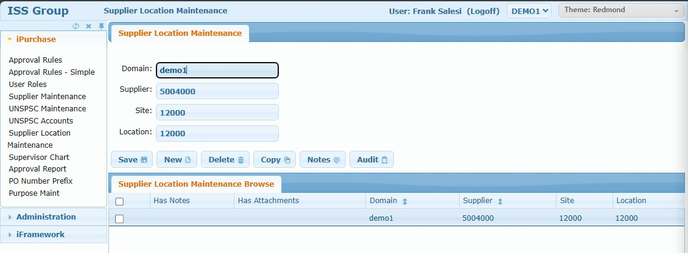

# Supplier Location Maintenance

## Overview

The Supplier Location Maintenance screen defines default receiving locations for supplier/site combinations. When a requisition line is created for a specific supplier and site, the system can auto-default the receiving location based on this mapping.

**Note:** This feature is rarely used but is available for organizations that need location defaulting based on supplier.

## How It Works

1. Create a mapping: Supplier + Site → Location
2. User creates requisition line for that supplier/site
3. System looks up the mapping
4. Location field is auto-populated on the requisition line
5. When PO is received, items go to the defaulted location

## Access Path

iPurchase → Supplier Location Maintenance

## Screenshot



## Screen Layout

The screen consists of:
1. **Supplier Location Maintenance** - Form for creating/editing mappings
2. **Supplier Location Maintenance Browse** - Grid listing all mappings

---

## Form Fields

### Field: Domain

- **Type**: Text
- **Required**: Yes
- **Database**: `xxloc_domain`
- **Description**: The domain this mapping applies to

### Field: Supplier

- **Type**: Text
- **Required**: Yes
- **Database**: `xxloc_supplier`
- **Description**: The supplier code (from Supplier Maintenance)

### Field: Site

- **Type**: Text
- **Required**: Yes
- **Database**: `xxloc_site`
- **Description**: The site/warehouse code

### Field: Location

- **Type**: Text
- **Required**: Yes
- **Database**: `xxloc_location`
- **Description**: The default receiving location for this supplier/site combination

---

## Action Buttons

| Button | Action |
|--------|--------|
| **Save** | Saves the mapping |
| **New** | Clears form to create a new mapping |
| **Delete** | Deletes the selected mapping |
| **Copy** | Duplicates the mapping |
| **Notes** | Add documentation notes |
| **Audit** | View change history |

---

## Browse Columns

| Column | Description |
|--------|-------------|
| Has Notes | Indicates if notes are attached |
| Has Attachments | Indicates if attachments exist |
| Domain | Domain code |
| Supplier | Supplier code |
| Site | Site/warehouse code |
| Location | Default receiving location |

---

## Database Table

**Table: `xxloc_mstr`**

| Field | Type | Description |
|-------|------|-------------|
| `xxloc_domain` | character | Domain |
| `xxloc_supplier` | character | Supplier code |
| `xxloc_site` | character | Site code |
| `xxloc_location` | character | Default location |
| `xxloc_has_notes` | logical | Has notes flag |
| `xxloc_has_attachments` | logical | Has attachments flag |

**Query Example:**
```sql
SELECT xxloc_domain, xxloc_supplier, xxloc_site, xxloc_location
FROM PUB.xxloc_mstr
WHERE xxloc_domain = 'demo1'
ORDER BY xxloc_supplier, xxloc_site
```

---

## Example

| Domain | Supplier | Site | Location |
|--------|----------|------|----------|
| demo1 | 5004000 (CDW) | 12000 | 12000 |
| demo1 | 5017000 (Grainger) | 12000 | 12500 |
| demo1 | 5017000 (Grainger) | 13000 | 13500 |

In this example:
- Items from CDW for site 12000 default to location 12000
- Items from Grainger for site 12000 default to location 12500
- Items from Grainger for site 13000 default to location 13500

---

## Related Screens

- [Supplier Maintenance](./ipurchase-04-supplier-maintenance.md) - Manage supplier records
