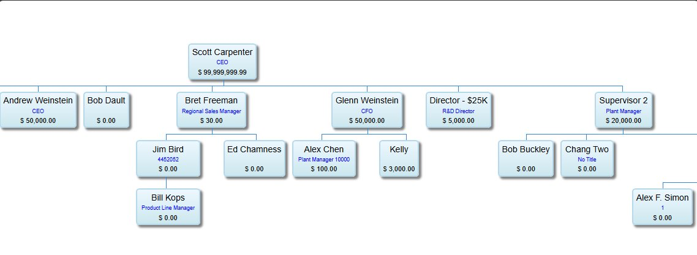

# Supervisor Chart

## Overview

The Supervisor Chart provides a visual organization chart automatically generated from the supervisor relationships defined in user records. Each user's `wus_supervisor` field creates the parent-child relationship that builds the tree.

This is a read-only visualization - to modify the hierarchy, edit individual user records in [Users and Groups](./01-users-and-groups.md).

## What It Shows

Each box in the chart displays:
- **User Name** - Full name from `wus_name`
- **Title** - Job title from `wus_title`
- **Approval Amount** - Approval limit from `wus_app_amt`

## Access Path

iPurchase → Supervisor Chart

## Screenshot



## How It Works

The chart is built by traversing the `wus_supervisor` field in `wus_mstr`:

1. Find users with no supervisor (top of org) → Root nodes
2. For each user, find all users where `wus_supervisor` = this user → Children
3. Recursively build the tree
4. Render as visual org chart

## Use Cases

- **Verify org structure** - Quickly confirm supervisor relationships are correct
- **Approval chain review** - See who approves for whom
- **Approval limit audit** - Review approval amounts across the organization
- **Onboarding** - Help new admins understand the hierarchy

## Data Source

The chart pulls from `wus_mstr`:

| Field | Chart Display |
|-------|---------------|
| `wus_name` | User name (box header) |
| `wus_title` | Title (blue text) |
| `wus_app_amt` | Approval amount ($ value) |
| `wus_supervisor` | Determines parent-child relationship |

**Query to see supervisor relationships:**
```sql
SELECT wus_id, wus_name, wus_supervisor, wus_app_amt, wus_title
FROM PUB.wus_mstr
WHERE wus_disable = FALSE
ORDER BY wus_supervisor, wus_name
```

## Tips

1. **Missing from chart?** - User may have no supervisor set, or supervisor field points to non-existent user
2. **Multiple roots** - Users with blank `wus_supervisor` appear as separate root nodes
3. **Circular references** - Avoid A → B → A supervisor chains (will cause issues)
4. **Approval amounts** - $0.00 means user has no independent approval authority

## Related Screens

- [Users and Groups](./01-users-and-groups.md) - Edit supervisor relationships and approval amounts
