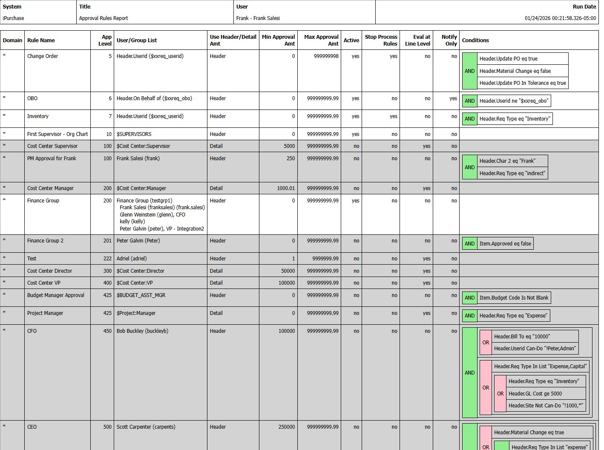

# Approval Report

## Overview

The Approval Report generates a comprehensive listing of all approval rules configured in the system. This read-only report is used for auditing and compliance purposes - compare current output to previous versions to identify any changes to approval routing.

**Primary use case:** Print/export periodically and compare to previous versions to detect unauthorized rule modifications.

## Access Path

iPurchase → Approval Report

## Screenshot



## Report Header

| Field | Description |
|-------|-------------|
| System | iPurchase |
| Title | Approval Rules Report |
| User | User who ran the report |
| Run Date | Timestamp when report was generated |

## Report Columns

| Column | Description |
|--------|-------------|
| Domain | Domain filter (`*` = all domains) |
| Rule Name | Descriptive name of the rule |
| App Level | Approval sequence number (determines order of evaluation) |
| User/Group List | Who must approve - can be user IDs, groups, or variables like `$Cost Center:Manager` |
| Use Header/Detail Amt | Whether amount threshold uses header total or line detail total |
| Min Approval Amt | Minimum amount for rule to apply |
| Max Approval Amt | Maximum amount for rule to apply |
| Active | Whether rule is currently active |
| Stop Process Rules | If true, stops evaluating further rules after this one matches |
| Eval at Line Level | If true, evaluates each line separately (can create multiple approval records) |
| Notify Only | If true, sends notification email but doesn't require approval |
| Conditions | Visual tree showing AND/OR conditions (for complex rules) |

## Conditions Display

For complex rules (xxAppRule), the Conditions column shows the hierarchical condition tree:

- **Green boxes** - AND/OR operators
- **White boxes** - Individual field conditions
- Tree structure shows nesting of conditions

**Example from screenshot:**
```
AND
├── Header.Update PO eq true
├── Header.Material Change eq false
└── Header.Update PO In Tolerance eq true
```

This rule matches change orders that are within tolerance limits.

## Data Sources

The report pulls from both simple and complex rule tables:

**Simple Rules (xxapp_mstr):**
- Basic AND-logic rules
- Conditions shown as simple field filters

**Complex Rules (xxAppRule + xxAppField):**
- AND/OR nested logic
- Conditions displayed as visual tree

## Use Cases

### Periodic Audit
1. Run report monthly/quarterly
2. Save as PDF or print
3. Compare to previous version
4. Investigate any differences

### Compliance Documentation
- Evidence of approval controls for auditors
- SOX compliance documentation
- Internal control verification

### Troubleshooting
- Review all rules in one view
- Identify overlapping or conflicting rules
- Verify sequence numbers are correct

## Tips

1. **Run regularly** - Establish a schedule (monthly, quarterly) for audit comparisons
2. **Archive reports** - Keep dated copies for audit trail
3. **Check sequence numbers** - Rules evaluate in sequence order; gaps or duplicates may indicate issues
4. **Review conditions** - Complex AND/OR trees can be hard to follow; use this report to verify logic

## Related Screens

- [Approval Rules (Complex)](./ipurchase-01-approval-rules.md) - Create/edit complex rules
- [Approval Rules - Simple](./ipurchase-02-approval-rules-simple.md) - Create/edit simple rules
- [User Roles](./ipurchase-03-user-roles.md) - Configure role-based approvers
