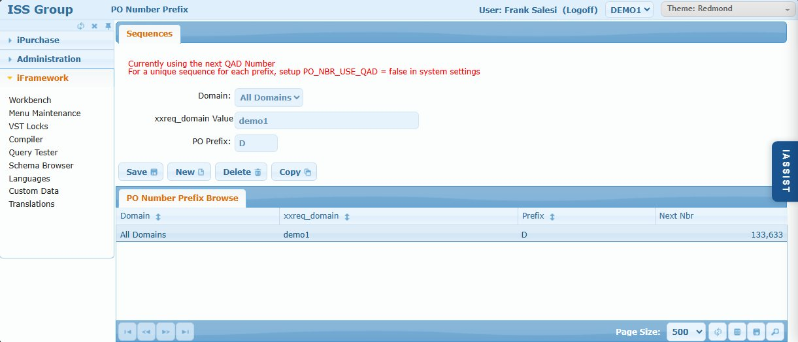

# PO Number Prefix

## Overview

The PO Number Prefix screen enhances QAD's standard PO numbering by allowing different prefixes based on domain, site, or other criteria. The sequence number still comes from QAD's single PO sequence (`poc_po_seq`), but iPurchase adds a configurable prefix.

**Use case:** Different sites or entities need distinct PO number prefixes while sharing the same sequence (e.g., Site 10000 uses "A" prefix, Site 12000 uses "B" prefix, both using QAD's next PO number).

## Access Path

iPurchase → PO Number Prefix

## Screenshot



**Note:** The screen displays a helpful message: "Currently using the next QAD Number. For a unique sequence for each prefix, setup PO_NBR_USE_QAD = false in system settings"

## Screen Layout

The screen consists of:
1. **Sequences** - Form for creating/editing prefix configurations
2. **PO Number Prefix Browse** - Grid listing all configured prefixes

---

## Form Fields

### Field: Domain

- **Type**: Dropdown
- **Database**: `pf_attr`
- **Description**: Domain this prefix applies to. Select "All Domains" (`*`) or a specific domain.

### Field: [Dynamic Field Name] Value

- **Type**: Text
- **Database**: `pf_value`
- **Description**: The value that triggers this prefix. The field label is dynamic based on the `PO_PREFIX_FIELD` system setting (e.g., if set to `xxreq_domain`, label shows "xxreq_domain Value").

### Field: PO Prefix

- **Type**: Text
- **Database**: `pf_alt_value`
- **Description**: The prefix to prepend to PO numbers (e.g., "D", "A", "B")

---

## Browse Columns

| Column | Database Field | Description |
|--------|----------------|-------------|
| Domain | `pf_attr` | Domain or "All Domains" |
| [Dynamic] | `pf_value` | Value from PO_PREFIX_FIELD (e.g., xxreq_domain) |
| Prefix | `pf_alt_value` | PO number prefix |
| Next Nbr | `pf_seq` | Display of QAD's next PO number (`poc_po_seq`) |

---

## Action Buttons

| Button | Action |
|--------|--------|
| **Save** | Saves the prefix configuration |
| **New** | Clears form to create a new prefix |
| **Delete** | Deletes the selected prefix |
| **Copy** | Duplicates the prefix |

---

## Database Storage

PO prefix configurations are stored in `pf_mstr`:

| Field | Value |
|-------|-------|
| `pf_us_id` | `SYSTEM` |
| `pf_group` | `POSEQ` |
| `pf_attr` | Domain (`*` = all) |
| `pf_value` | Value matching PO_PREFIX_FIELD |
| `pf_alt_value` | Prefix |
| `pf_seq` | Display only - actual sequence from QAD `poc_po_seq` |

**Query Example:**
```sql
SELECT pf_attr AS domain, pf_value AS field_value, 
       pf_alt_value AS prefix, pf_seq AS next_nbr
FROM PUB.pf_mstr
WHERE pf_us_id = 'SYSTEM' AND pf_group = 'POSEQ'
ORDER BY pf_attr, pf_value
```

---

## Related System Settings

| Setting | Current Value | Description |
|---------|---------------|-------------|
| **PO_NBR_USE_QAD** | `false` | When `true`, uses QAD's prefix AND sequence. When `false`, uses iPurchase prefixes with QAD's sequence. |
| **PO_PREFIX_FIELD** | `xxreq_domain` | The requisition field used to determine which prefix to use. Controls the dynamic field label and browse column header. |

---

## How It Works

1. Requisition is approved and ready for PO creation
2. System reads `PO_PREFIX_FIELD` setting to determine lookup key (e.g., `xxreq_domain`)
3. System looks up `pf_mstr` where `pf_group = 'POSEQ'` and matches domain + field value
4. If found, uses that prefix
5. If not found, falls back to `*` (all domains) entry
6. System gets next number from QAD's `poc_po_seq` field
7. PO number = Prefix + QAD Next Number (e.g., "D133633")

## Examples

### Example 1: Single Prefix for All

| Domain | xxreq_domain | Prefix | Next Nbr |
|--------|--------------|--------|----------|
| All Domains | demo1 | D | 133633 |

All POs get "D" prefix with QAD's sequence: D133633, D133634, D133635...

### Example 2: Site-Specific Prefixes (Shared Sequence)

If `PO_PREFIX_FIELD = xxreq_site`:

| Domain | xxreq_site | Prefix |
|--------|------------|--------|
| demo1 | 10000 | A |
| demo1 | 12000 | B |
| All Domains | * | X |

All sites share QAD's sequence, just with different prefixes:
- Site 10000 PO: A133633
- Site 12000 PO: B133634
- Other site PO: X133635

---

## Tips

1. **Always have a fallback** - Create an "All Domains" entry to handle cases that don't match specific rules
2. **Prefixes help identification** - Even with shared sequence, prefixes make it easy to identify PO origin
3. **Coordinate with QAD** - If `PO_NBR_USE_QAD = true`, this screen has no effect

---

## Related Screens

- [System Settings](./02-system-settings.md) - Configure PO_NBR_USE_QAD, PO_PREFIX_FIELD
